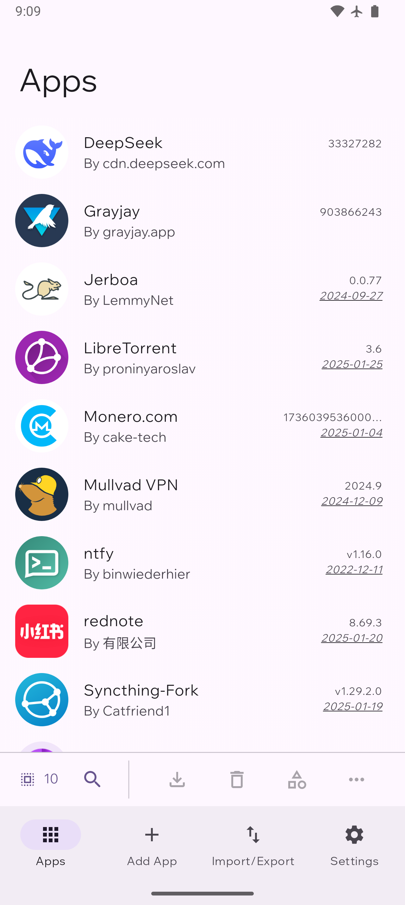
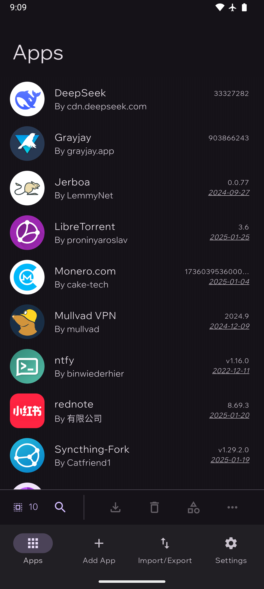
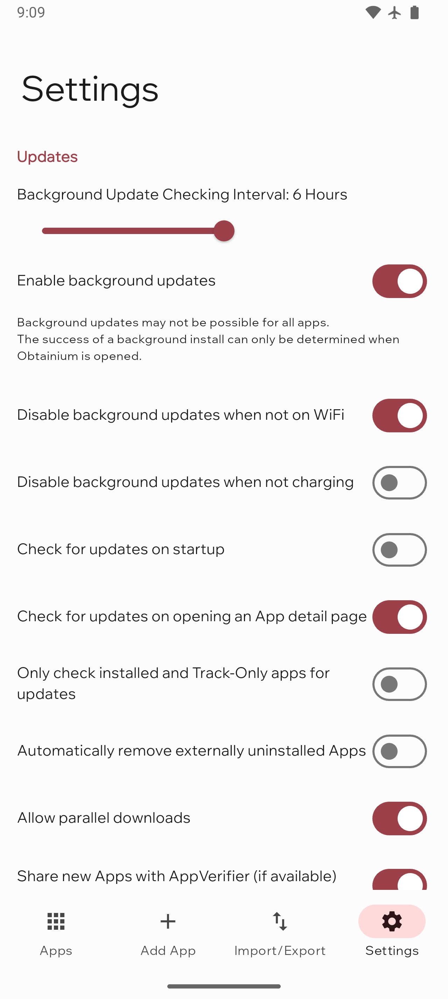
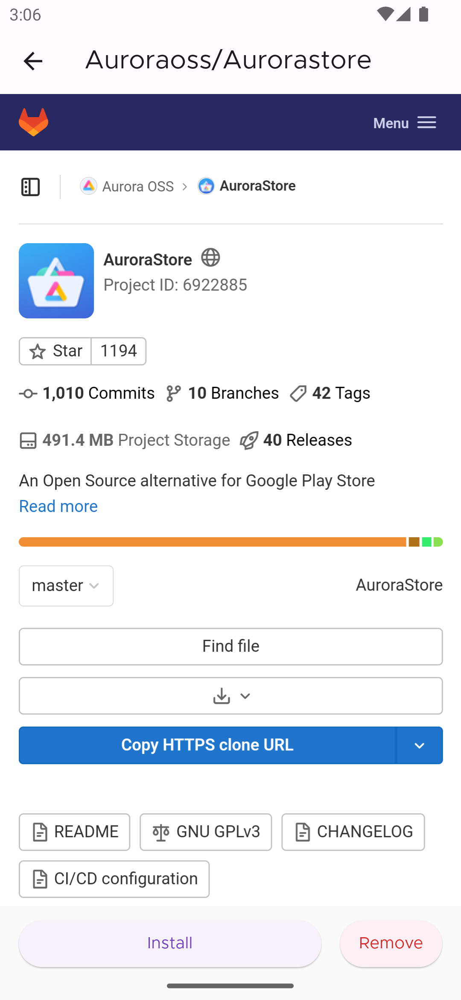
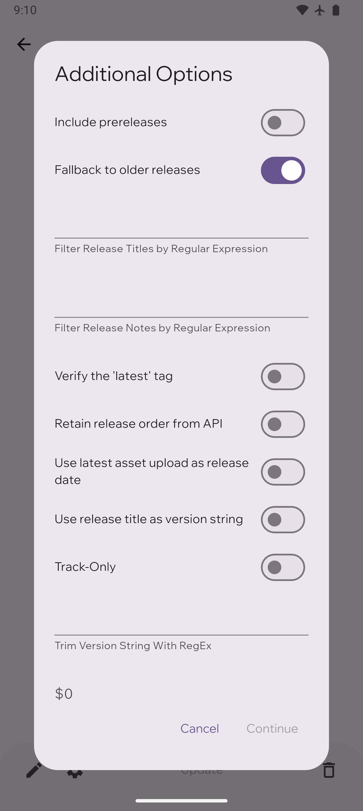

#  Obtainium

Get Android app updates straight from the source.

Obtainium allows you to install and update apps directly from their releases pages, and receive notifications when new releases are made available.

More info:
- [Obtainium Wiki](https://wiki.obtainium.imranr.dev/) ([repository](https://github.com/ImranR98/Obtainium-Wiki))
- [Obtainium 101](https://www.youtube.com/watch?v=0MF_v2OBncw) - Tutorial video
- [AppVerifier](https://github.com/soupslurpr/AppVerifier) - App verification tool (recommended, integrates with Obtainium)
- [apps.obtainium.imranr.dev](https://apps.obtainium.imranr.dev/) - Crowdsourced app configurations ([repository](https://github.com/ImranR98/apps.obtainium.imranr.dev))
- [Side Of Burritos - You should use this instead of F-Droid | How to use app RSS feed](https://youtu.be/FFz57zNR_M0) - Original motivation for this app
- [Website](https://obtainium.imranr.dev) ([repository](https://github.com/ImranR98/obtainium.imranr.dev))
- [Source code](https://github.com/ImranR98/Obtainium)

Currently supported App sources:
- Open Source - General:
  - [GitHub](https://github.com/)
  - [GitLab](https://gitlab.com/)
  - [Forgejo](https://forgejo.org/) ([Codeberg](https://codeberg.org/))
  - [F-Droid](https://f-droid.org/)
  - Third Party F-Droid Repos
  - [IzzyOnDroid](https://android.izzysoft.de/)
  - [SourceHut](https://git.sr.ht/)
- Other - General:
  - [APKPure](https://apkpure.net/)
  - [Aptoide](https://aptoide.com/)
  - [Uptodown](https://uptodown.com/)
  - [Huawei AppGallery](https://appgallery.huawei.com/)
  - [Tencent App Store](https://sj.qq.com/)
  - [RuStore](https://rustore.ru/)
  - Jenkins Jobs
  - [APKMirror](https://apkmirror.com/) (Track-Only)
- Other - App-Specific:
  - [Telegram App](https://telegram.org/)
  - [Neutron Code](https://neutroncode.com/)
- Direct APK Link
- "HTML" (Fallback): Any other URL that returns an HTML page with links to APK files

## Finding App Configurations

You can find crowdsourced app configurations at [apps.obtainium.imranr.dev](https://apps.obtainium.imranr.dev).

If you can't find the configuration for an app you want, feel free to leave a request on the [discussions page](https://github.com/ImranR98/apps.obtainium.imranr.dev/discussions/new?category=app-requests).

Or, contribute some configurations to the website by creating a PR at [this repo](https://github.com/ImranR98/apps.obtainium.imranr.dev).

## Installation

     
Verification info:
- Package ID: `dev.imranr.obtainium`
- SHA-256 Hash of Signing Certificate: `B3:53:60:1F:6A:1D:5F:D6:60:3A:E2:F5:0B:E8:0C:F3:01:36:7B:86:B6:AB:8B:1F:66:24:3D:A9:6C:D5:73:62`
  - Note: The above signature is also valid for the F-Droid flavour of Obtainium, thanks to [reproducible builds](https://f-droid.org/docs/Reproducible_Builds/).
- [PGP Public Key](https://keyserver.ubuntu.com/pks/lookup?search=contact%40imranr.dev&fingerprint=on&op=index) (to verify APK hashes)

## Limitations
- For some sources, data is gathered using Web scraping and can easily break due to changes in website design. In such cases, more reliable methods may be unavailable.

## Screenshots

|  |            |     |
| ------------------------------------------------------ | ----------------------------------------------------------------------- | -------------------------------------------------------------------- |
|    |  |  |
