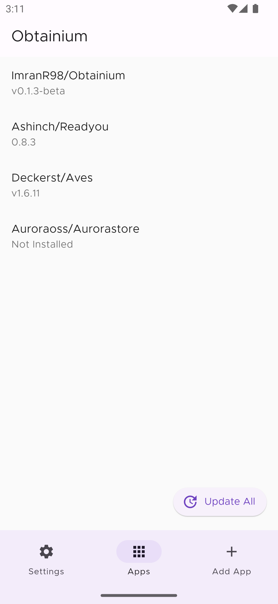
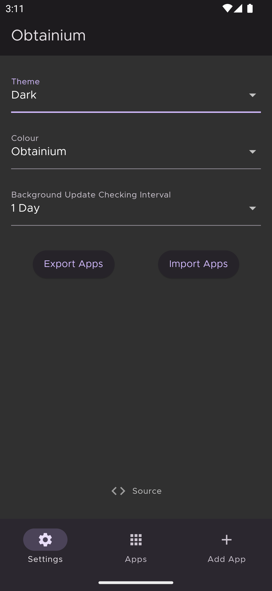
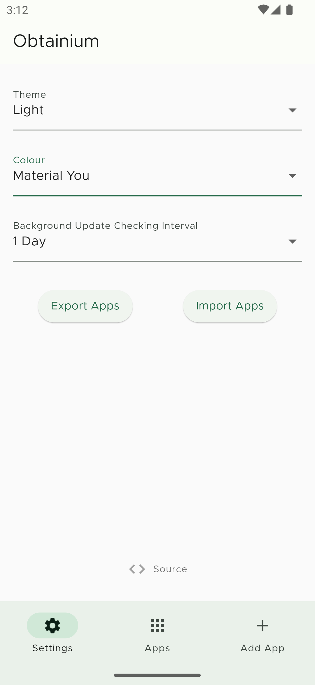

#  Obtainium

Get Android App Updates Directly From the Source.

Obtainium allows you to install and update Open-Source Apps directly from their releases pages, and receive notifications when new releases are made available.

Motivation: [Side Of Burritos - You should use this instead of F-Droid | How to use app RSS feed](https://youtu.be/FFz57zNR_M0)

Currently supported App sources:
- [GitHub](https://github.com/)
- [GitLab](https://gitlab.com/)
- [F-Droid](https://f-droid.org/)
- [Mullvad](https://mullvad.net/en/)
- [Signal](https://signal.org/)

## Limitations
- App installs are assumed to have succeeded; failures and cancelled installs cannot be detected.
- Auto (unattended) updates are unsupported due to a lack of any capable Flutter plugin.
- For some sources, data is gathered using Web scraping and can easily break due to changes in website design. In such cases, more reliable methods are either unavailable (e.g. Mullvad), insufficient (e.g. GitHub RSS) or subject to rate limits (e.g. GitHub API).

## Screenshots

|  |            |     |
| ------------------------------------------------------ | ----------------------------------------------------------------------- | -------------------------------------------------------------------- |
|    |  |  |
