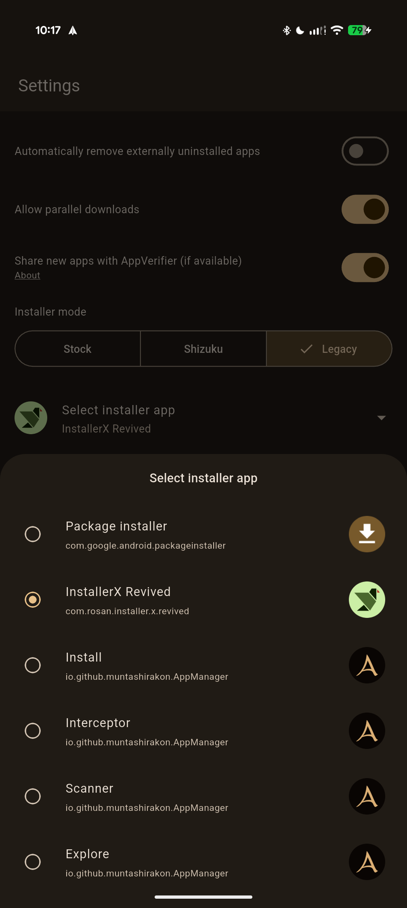
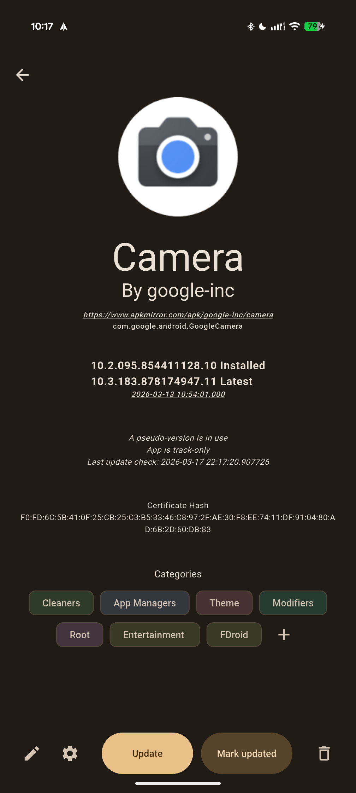

#  ObtainX

## Extra features in ObtainX

ObtainX is a fork of Obtainium. These are the extra features you get in this fork:

- **Installer choice** – In Settings, you can choose how APKs are installed: **Stock** (default), **Shizuku**, or **Legacy**. Legacy mode lets you pick a custom installer (e.g. InstallerX, App Manager etc.) to handle the APK.

- **Better tracking for track-only sources like APKMirror** 

  - For track-only apps, Obtainium did not fetch the already installed app version and always showed "latest is installed," which was wrong. That is fixed here: the installed version is now read from the device when a package ID is available. 
  - Added a new "Update" button to track-only app pages, tapping which opens the **specific update version page** (not just the app landing page). 
  - Smarter version comparison so strings like `50.5.19` and `50.5.19-31 [PR]` are treated as the same. 
- **Few UI Upgrades** - The text-only action buttons are replaced with **Material 3 expressive buttons**

## Screenshots
|  |  | 
| ------------------------------------------------------ | ----------------------------------------------------------------------- | 

## Original Obtainium

Read the orignal Optainium [ReadMe here](https://github.com/ImranR98/Obtainium/blob/main/README.md)
