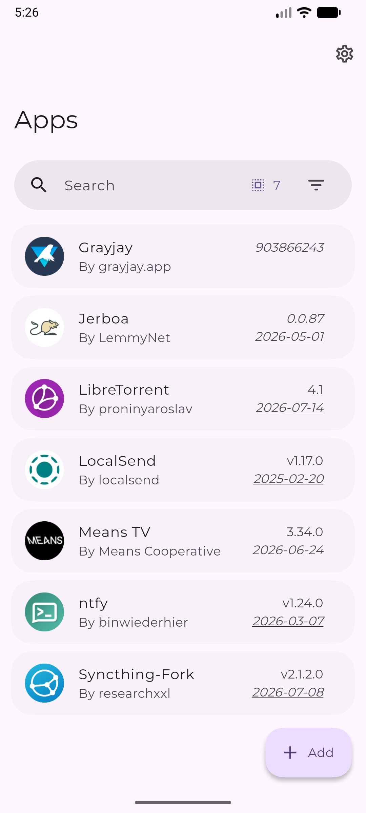
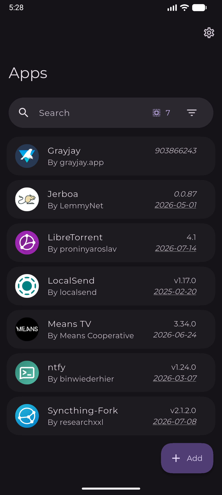
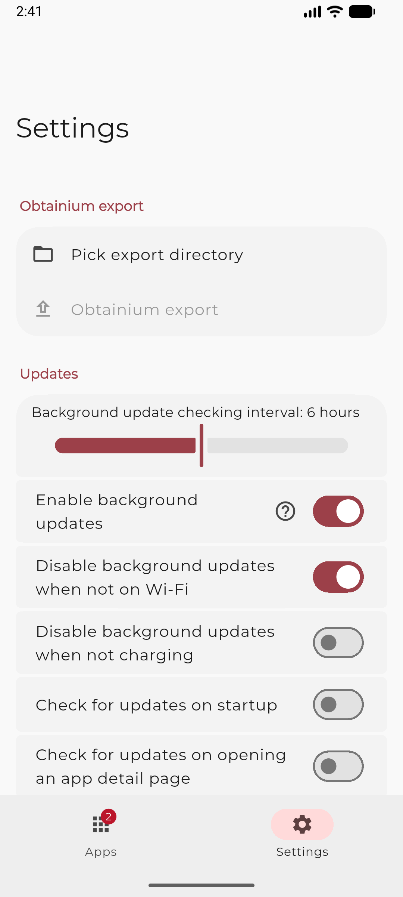
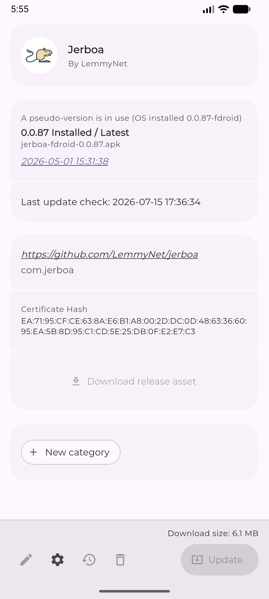
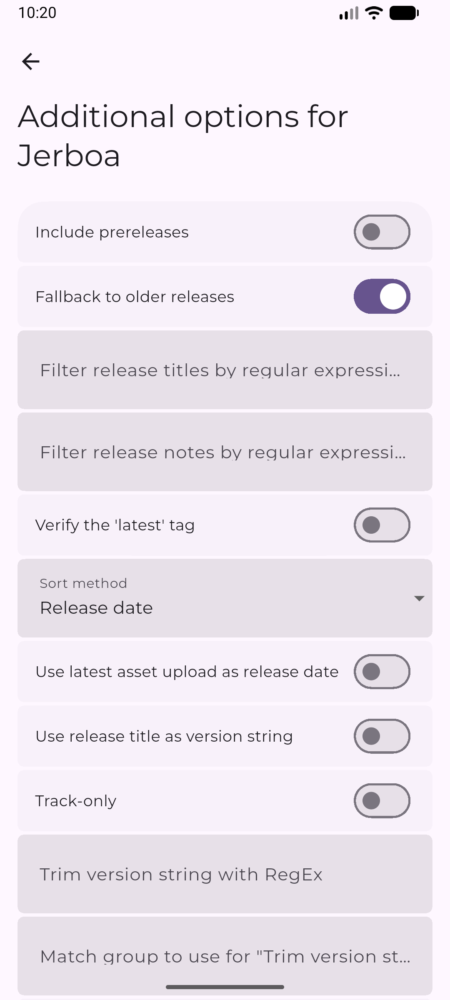
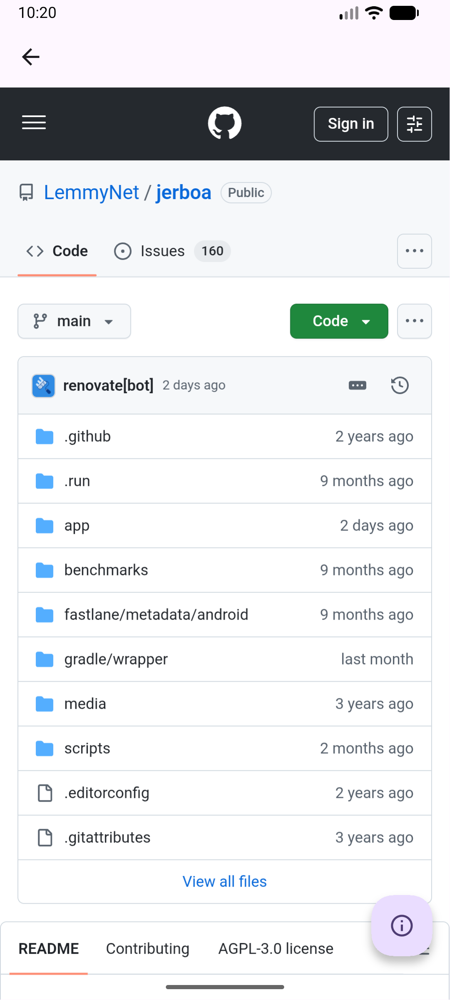

#  Obtainium

Get Android app updates straight from the source.

Obtainium allows you to install and update apps directly from their releases pages, and receive notifications when new releases are made available.

More info:
- [Obtainium Wiki](https://wiki.obtainium.page/) ([repository](https://github.com/ImranR98/Obtainium-Wiki))
- [Obtainium 101](https://www.youtube.com/watch?v=0MF_v2OBncw) - Tutorial video
- [AppVerifier](https://github.com/soupslurpr/AppVerifier) - App verification tool (recommended, integrates with Obtainium)
- [apps.obtainium.page](https://apps.obtainium.page/) - Crowdsourced app configurations ([repository](https://github.com/ImranR98/apps.obtainium.page))
- [Side Of Burritos - You should use this instead of F-Droid | How to use app RSS feed](https://youtu.be/FFz57zNR_M0) - Original motivation for this app
- [Website](https://obtainium.page) ([repository](https://github.com/ImranR98/obtainium.page))

Currently supported App sources:
- Open Source - General:
  - [GitHub](https://github.com/)
  - [GitLab](https://gitlab.com/)
  - [Forgejo](https://forgejo.org/) ([Codeberg](https://codeberg.org/))
  - [F-Droid](https://f-droid.org/)
  - Third Party F-Droid Repos
  - [IzzyOnDroid](https://android.izzysoft.de/)
  - [SourceHut](https://git.sr.ht/)
- Other - General:
  - [APKPure](https://apkpure.net/)
  - [Aptoide](https://aptoide.com/)
  - [Uptodown](https://uptodown.com/)
  - [APKCombo](https://apkcombo.com/)
  - [itch.io](https://itch.io/)
  - [Huawei AppGallery](https://appgallery.huawei.com/)
  - [Tencent App Store](https://sj.qq.com/)
  - [vivo App Store (CN)](https://h5.appstore.vivo.com.cn/)
  - [RuStore](https://rustore.ru/)
  - [Farsroid](https://www.farsroid.com)
  - [CoolApk](https://coolapk.com/)
  - [LiteAPKs](https://liteapks.com/)
  - [APK4Free](https://apk4free.net/)
  - Jenkins Jobs
  - [APKMirror](https://apkmirror.com/) (Track-Only)
  - [RockMods](https://rockmods.net/) (Track-Only)
- Other - App-Specific:
  - [Telegram App](https://telegram.org/)
  - [Neutron Code](https://neutroncode.com/)
- Direct APK Link
- "HTML" (Fallback): Any other URL that returns an HTML page with links to APK files

## Finding App Configurations

You can find crowdsourced app configurations at [apps.obtainium.page](https://apps.obtainium.page).

If you can't find the configuration for an app you want, feel free to leave a request on the [discussions page](https://github.com/ImranR98/apps.obtainium.page/discussions/new?category=app-requests).

Or, contribute some configurations to the website by creating a PR at [this repo](https://github.com/ImranR98/apps.obtainium.page).

## Installation

     
Verification info:

| Item | Value |
|------|-------|
| Package ID | `dev.imranr.obtainium` |
| Signing cert SHA-256 | `B3:53:60:1F:6A:1D:5F:D6:60:3A:E2:F5:0B:E8:0C:F3:01:36:7B:86:B6:AB:8B:1F:66:24:3D:A9:6C:D5:73:62` |
| PGP Public Key | [keyserver.ubuntu.com](https://keyserver.ubuntu.com/pks/lookup?search=contact%40imranr.dev&fingerprint=on&op=index) (verify APK hashes) |

The signing certificate is also valid for the F-Droid flavour, thanks to [reproducible builds](https://f-droid.org/docs/Reproducible_Builds/).

## Limitations
- For some sources, data is gathered using Web scraping and can easily break due to changes in website design. In such cases, more reliable methods may be unavailable.

## Troubleshooting

### App not updating
- Verify the URL matches the source's expected format (e.g. GitHub requires `owner/repo`)
- Pull down on the apps list to force a refresh
- If using GitHub, rate limits may block updates without a Personal Access Token configured in settings

## Screenshots

|  |            |     |
| ------------------------------------------------------ | ----------------------------------------------------------------------- | -------------------------------------------------------------------- |
|    |  |  |
