# ObtainX

ObtainX is a modern and supercharged fork of Obtainium. Re-engineered with a stunning Material 3 Expressive UI, it delivers an ultra-smooth interface packed with power-user utilities that make managing your Android apps effortless. 

> [!TIP]
> Curious how ObtainX stacks up against Obtainium? Check out my side-by-side [ObtainX vs Obtainium comparison](docs/Difference_with_Obtainium.md) featuring full interface screenshots.

<strong>Featured by HowToMen: Best Android Apps - May 2026! 🎊</strong>

  

## 📦 Installation

## 🔄 Seamlessly bring your data from Obtainium

If you want to try out **ObtainX** without losing your current setup, you can bring your existing app list over in seconds:

- In Obtainium: Open **Settings** and find the **Obtainium export** section, tap Export, and save the resulting .json file. (Older Obtainium versions kept this on a dedicated *Import/Export* tab.)
- In ObtainX: Go to the `Backup` tab, select Import, and choose that exact .json file.
- Continue where you left off: All your tracked apps and settings will be instantly populated.

## ✨ Exclusive features in ObtainX

These are built from the ground up and are exclusive in ObtainX.

### 🛡️ Security & Integrity

- **🛡️ Build verification checks** — Runs automated cryptographic checks (F-Droid/Izzy reproducible builds, GitHub Release Attestations) on apps you add to flag tampered binaries before install. For total integrity, ObtainX's own updates are reproducible (F-Droid) and attested (GitHub). Learn more in the [Build Verification Guide](docs/build-verification-guide.md).

- **🦠 VirusTotal APK scanning** — Optionally scan downloaded APKs with VirusTotal before installation. You are in control - flagged or failed scans ask you what to do during installs.

### 🗂️ Smart Organization

- **📥 Bulk import from fevice** — Select any apps already on your phone and ObtainX automatically finds their sources on stores you choose. No URL hunting one by one.
- **✅ Selective backup restore** — Instead of forced to blindly import entire backup file, you get to pick n choose what you want to restore from your backup. 
- **🗂️ Dynamic folders** — Group apps into folders manually or via automatic routing rules (by name, author, category, source etc.). Each folder retains its own layouts.
- **🕐 On-Demand Only mode** — Mark rarely updated apps so they're hidden from the main list and aren't checked during global update scans. Query them only on-demand.
- **👆 Configurable two-way swipe gestures** — Left and right swipe actions are independently configurable per row. Choose from Update, Install, Pin, Edit, Delete, Open, App Info, or None.
- **↩️ Undo after delete** — Revert accidental app removals instantly via a 5-second toast notification.
- **🖼️ Custom app icons** — Not happy with an app's icon or a blank placeholder? Tap the icon on any app's detail page to set your own — pick from your gallery or grab one from the web.
- **🔍 Verified "also available on" store links** — Each app detail page shows a list of other stores (beside the one you are tracking) where the app is available. Only confirmed-present stores are shown. 

### 🚀 Advanced Update Controls

- **🧩 Advanced filter / RegEx assist** — A built-in helper walks you through building regex filters on any field that supports them. No regex knowledge required. Full details in the [Additional options guide](docs/additional-options-guide.md).
- **⏭️ Skip version** — Skip a specific release you don't want without marking the app as "updated." The next release will still show up normally.
- **💾 Save assets** — Option to automatically save update assets (e.g. APKs) to your chosen folder, during update process itself.

### 🎨 Interface & Experience

- **🌈 Per-app color theming** — Each app's detail page derives its color scheme from the app's own icon. Deep, accurate, and dark-mode safe. Toggle *Match app page to icon colors* in Settings.
- **🪄 Hero icon transition** — Tapping an app row animates its icon smoothly into the detail page. Swipe back and it returns the same way.
- **🎫 Rich, customizable app rows** — See app type, tracking source, and category tags at a glance. Choose between full text badges or minimal stacked color strips to keep your list clean and uncluttered.
- **✏️ Inline edit on detail page** — Edit any app's metadata directly from its detail page. An unsaved-changes guard prevents accidental data loss.
- **⚙️ View options on Apps tab** — Grouping, sort order, and other organization controls live on the Apps tab itself (instead of separate settings page) so you can tune the list and see the result immediately.

## 🧭 Pioneered by ObtainX — now in Obtainium too

These features were also built from ground up and first released in ObtainX; and are now available in Obtainium too.

- **📦 Third-Party Installer Support** — Hand off updates to third-party installers like InstallerX or App Manager to review APK metadata (trackers, permissions, target SDK etc.) before installing (data hidden by stock installers). Essential for devices running under Google _Advanced Protection_.
- **⚖️ Know the update size beforehand** — See the exact download size for every update - across supported stores - before you even hit the update button.
- **🛑 Stop download** — You can stop any ongoing download from the app, the notification, or the update queue.
- **🏷️ Category customization** — Pick an exact color (hex or hue slider) and rename a category so every app carrying it updates automatically.
  - Feature still exclusive to ObtainX: automatic black/white label text for readability at any color, and bulk edits that **merge** (add/remove) instead of overwriting each app's existing categories.
- **📐 Adaptive tablet, foldable & landscape layout** — On large screens the app list sits **side-by-side with the app's detail page**, so tapping or editing a row opens it in place rather than pushing a full screen. Obtainium adopted this two-pane app list later — but that one screen is as far as its tablet support goes.
  - Feature still exclusive to ObtainX: a genuinely complete tablet UI. A **navigation rail pinned on the left** lets you jump between tabs from anywhere, and the **Settings, add-app and bulk-import** screens all reshape into proper two-panel big-screen layouts too. In Obtainium, every screen except the apps list currently retain their single-pane phone layout.
- **💫 Material 3 Expressive throughout** — Full M3 Expressive treatment across every screen: cards, fluid animations, expressive sliders, FAB and controls that feel like one product.
- **🔎 Live search bar** — An on-page search bar with the list filtering live as you type (Obtainium originally offered only the filter sheet).
  - Feature still exclusive to ObtainX: Obtainium's search bar scrolls away with the apps list, so after scrolling down you must scroll to the top to reach it. ObtainX keeps a small search button pinned at the top (without wasting space), so you can jump into search from anywhere.
- **🗃️ Settings and form options in cards** — Settings are visibly grouped into labeled cards instead of one long wall of options.
  - Feature still exclusive to ObtainX: each section card is **collapsible** -  independently or collapse-all. And the per-app **Additional options** screen is sorted into categorized section cards, where Obtainium still shows one long, undifferentiated list.

## 🔧 Enhanced Features

Optimizations made to legacy Obtainium features.

- **🏪 APKMirror updates** — In Obtainium, APKMirror apps are track-only, so the update button has nowhere to take you — you can only mark a version as installed. ObtainX keeps tracking accurate but makes the update action functional, opening the specific release page for the new version. (Bulk Import is also supported.)

- **🧠 Smarter version status** — ObtainX handles harmless version label differences more intelligently, so you're only notified when there's genuinely something new. Six distinct states instead of a binary "update / up to date" pair: *up to date*, *update available*, *device is ahead*, *same version shown differently*, *genuinely unclear* and *Not installed*.

- **🎯 Add App — three paths, one screen** — URL, Search, and From Device are all on one screen under a segmented control. Search results load inline alongside store chips — no floating sheets, no separate screens. New searches can be started without needing to go back-n-forth. 

- **🔭 Track-only source improvements** — Shows installed version from the device when the package ID is known. The Update button opens the concrete release page, not just the app listing. In Obtainium, if the wrong package ID is fetched (or none at all), the app shows as "not installed" forever and update notifications never work right — with no way to fix it. ObtainX surfaces this clearly and lets you **edit the package ID directly from the app page**, instantly restoring correct install detection and update tracking.

- **🔖 Powerful, live filtering** — ObtainX rebuilds Obtainium's basic filter into a powerful tool. Filters like up-to-date, installed and track-only become **three-state** (include / exclude / off) instead of simple on/off toggles, and categories can be **included or excluded** and matched by **Any or All** — where Obtainium only lets you *include* categories, matched as "any." The apps list **updates live** as you change options, with no apply step required. Active filters also appear as dismissible **chips** at the top: tap one to clear just that filter.

- **🎛️ Total theme customization** — You control the theme (system, light, dark, AMOLED), color (Material You, presets or any HEX), palette, color shading intensity, gradient, progressive blur, roundness of UI corners, UI scale, and more. It's not just an afterthought - it's a full blown theme engine. Make it yours. 

- **🗄️ Richer app list grouping** — Group by source (Obtainium adopted in July 2026), app type (user/system/privileged) etc. A separate level of intelligent grouping for "Updates", "non-installed" and "track-only" apps.

---

## 🖼️ Screenshots

<table>
<tr>
<td width="33%" align="center" valign="top">
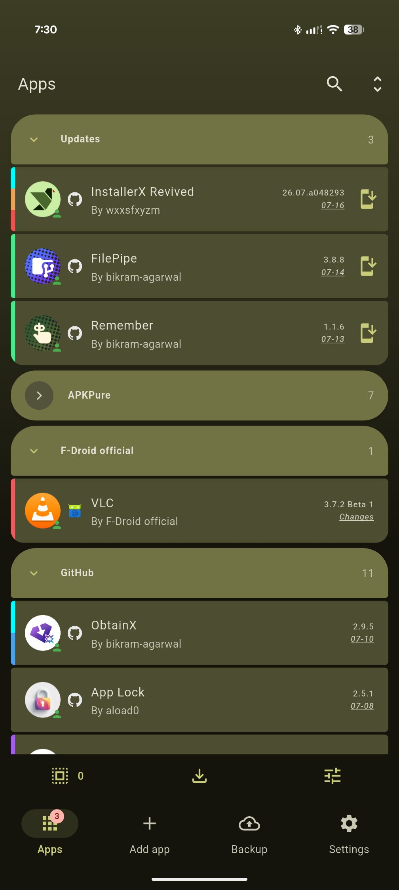 
</td>
<td width="33%" align="center" valign="top">
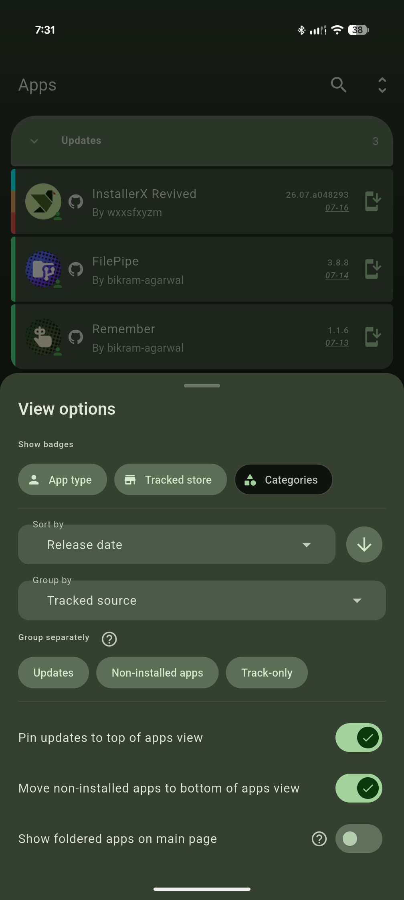 
</td>
<td width="33%" align="center" valign="top">
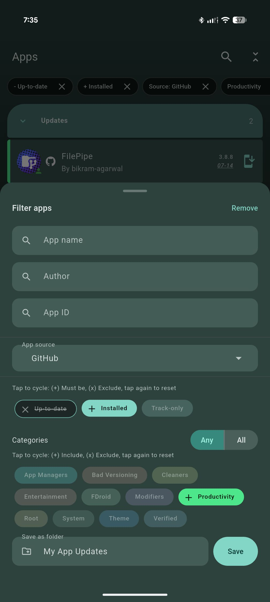 
</td>
</tr>

<tr>
<td width="33%" align="center" valign="top">
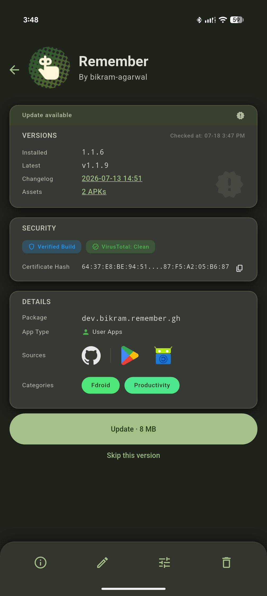 
</td>
<td width="33%" align="center" valign="top">
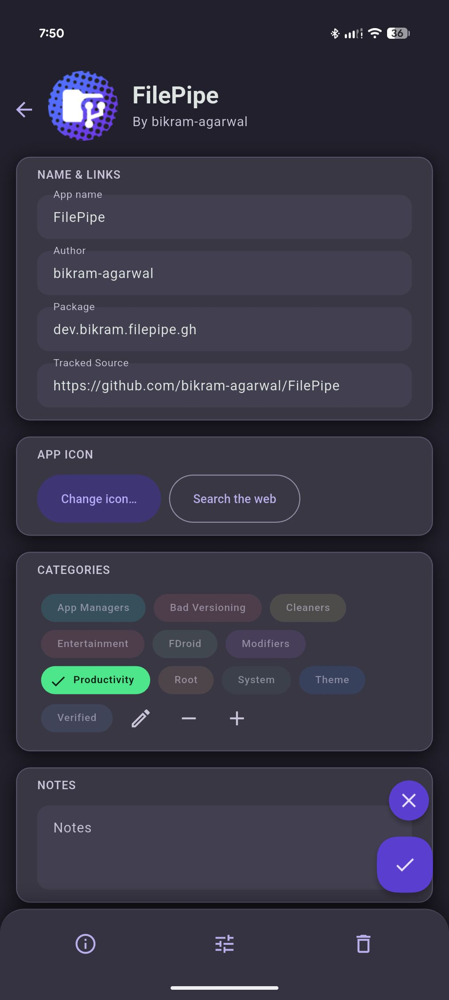 
</td>
<td width="33%" align="center" valign="top">
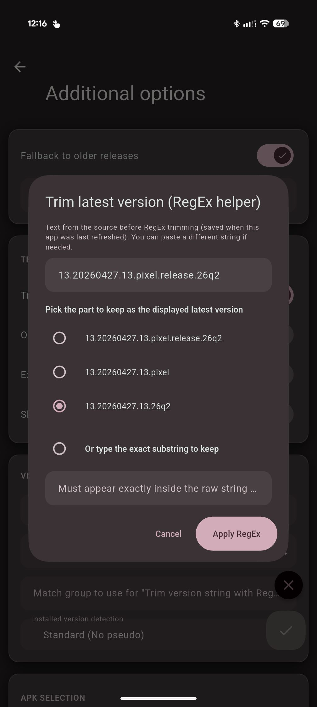 
</td>
</tr>

<tr>
<td width="33%" align="center" valign="top">
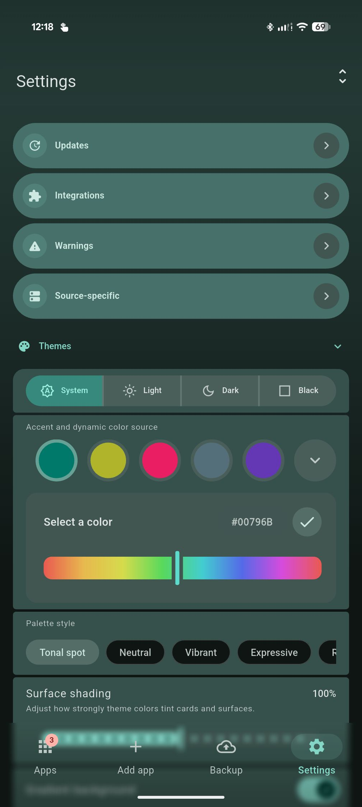 
</td>
<td width="33%" align="center" valign="top">
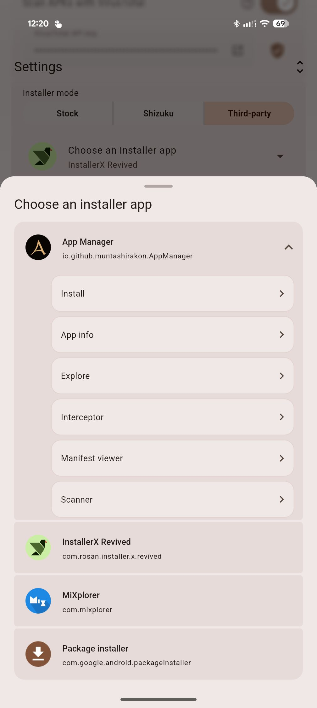 
</td>
<td width="33%" align="center" valign="top">
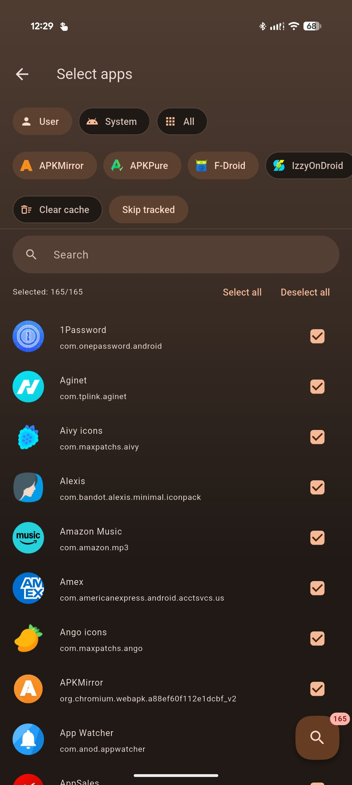 
</td>
</tr>
</table>

<table>
<tr>
<td width="50%" align="center" valign="top">
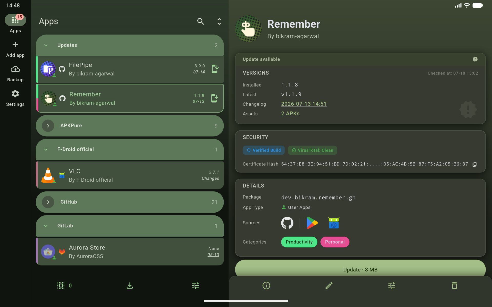 
</td>
<td width="50%" align="center" valign="top">
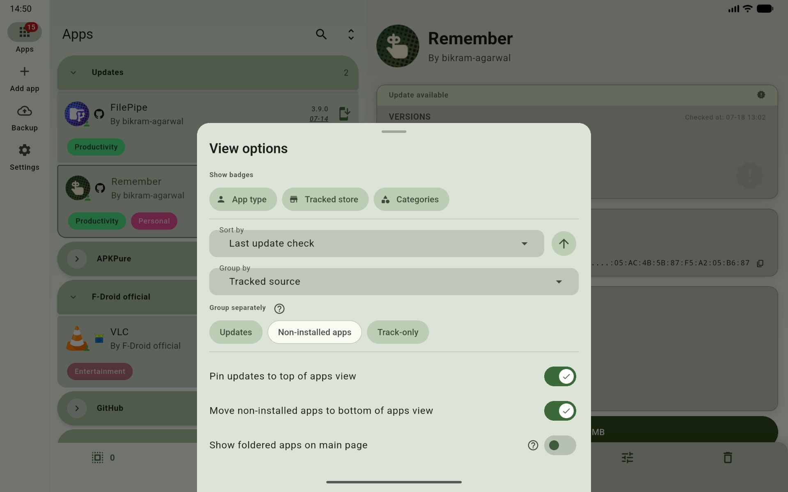 
</td>
</tr>

<tr>
<td width="50%" align="center" valign="top">
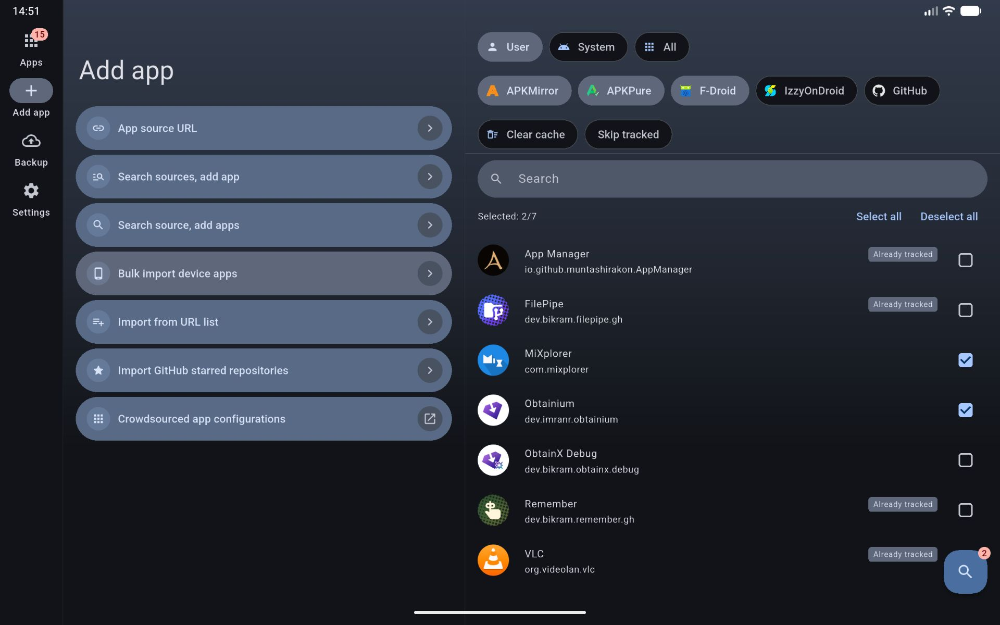 
</td>
<td width="50%" align="center" valign="top">
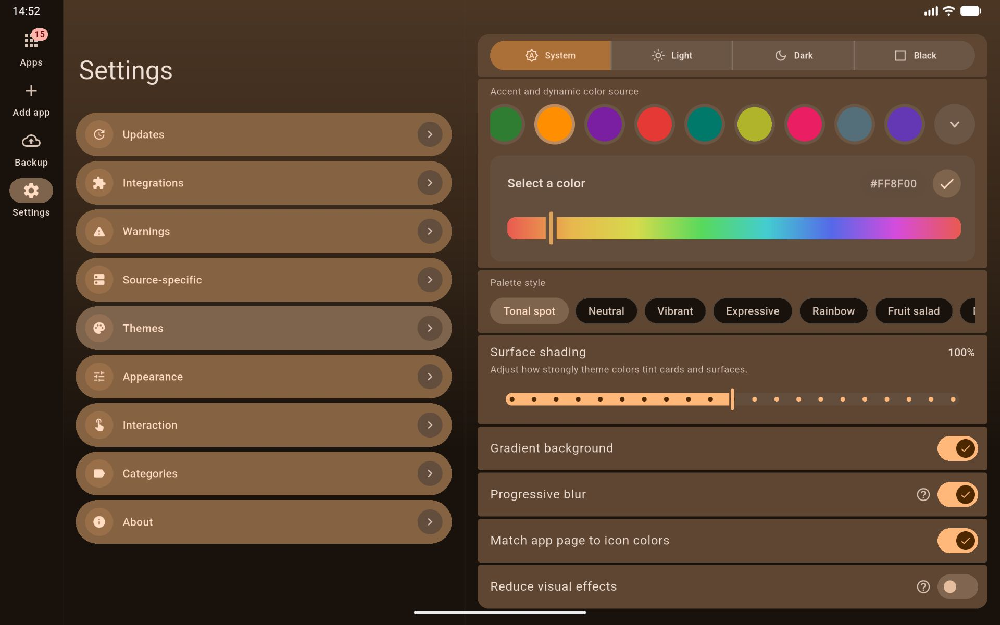 
</td>
</tr>
</table>

## 🎥 Screenrecords

<table>
<tr>
<td width="33%" align="center" valign="top">
<video src="https://github.com/user-attachments/assets/e34820a8-6d25-4f9b-831c-9446d69fc459" width="300" controls muted></video>
</td>
<td width="33%" align="center" valign="top">
<video src="https://github.com/user-attachments/assets/24399a36-afb9-4955-944f-c0f3e3f093ac" width="300" controls muted></video>
</td>
<td width="33%" align="center" valign="top">
<video src="https://github.com/user-attachments/assets/72c4d23e-7371-4fbd-9bc5-84a51ce54a78" width="300" controls muted></video>
</td>
</tr>
</table>

## Original Obtainium

ObtainX is a fork of Obtainium, licensed under [GPL-v3](LICENSE.txt). 

Read the original Obtainium [README here](https://github.com/ImranR98/Obtainium/blob/main/README.md).

## ➕ More Apps

<table>
  <tr>
    <td width="50%" align="center">
      <a href="https://github.com/bikram-agarwal/Remember">
        
      <b>Remember</b></a>
      
Notes, tasks, and reminders that keep coming back until they are done.

    </td>
    <td width="50%" align="center">
      <a href="https://github.com/bikram-agarwal/FilePipe">
        
      <b>FilePipe</b></a>
      
Your files, your rules. Automatically sort and move media with smart rules.

    </td>
  </tr>
</table>

---

Made with ❤️ by Bikram Agarwal
