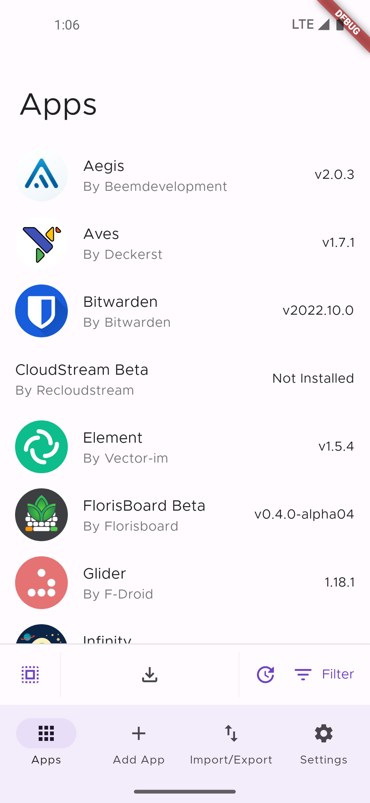
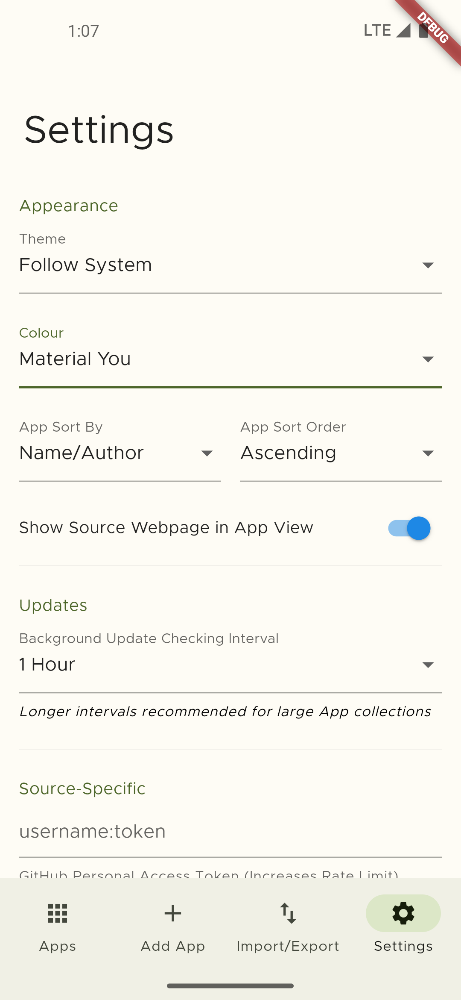
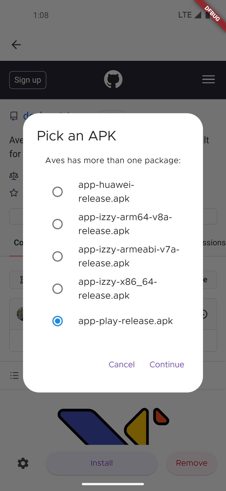
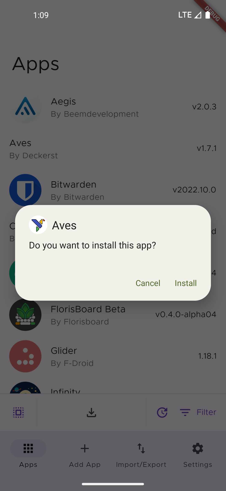

#  Obtainium

Get Android App Updates Directly From the Source.

Obtainium allows you to install and update Open-Source Apps directly from their releases pages, and receive notifications when new releases are made available.

Motivation: [Side Of Burritos - You should use this instead of F-Droid | How to use app RSS feed](https://youtu.be/FFz57zNR_M0)

Currently supported App sources:
- [GitHub](https://github.com/)
- [GitLab](https://gitlab.com/)
- [F-Droid](https://f-droid.org/)
- [IzzyOnDroid](https://android.izzysoft.de/)
- [Mullvad](https://mullvad.net/en/)
- [Signal](https://signal.org/)
- [APKMirror](https://apkmirror.com/) (Track-Only)

## Limitations
- App installs happen asynchronously and the success/failure of an install cannot be determined directly. This results in install statuses and versions sometimes being out of sync with the OS until the next launch or until the problem is manually corrected.
- Auto (unattended) updates are unsupported due to a lack of any capable Flutter plugin.
- For some sources, data is gathered using Web scraping and can easily break due to changes in website design. In such cases, more reliable methods may be unavailable.

## Screenshots

|  |            |     |
| ------------------------------------------------------ | ----------------------------------------------------------------------- | -------------------------------------------------------------------- |
|    |  |  |
