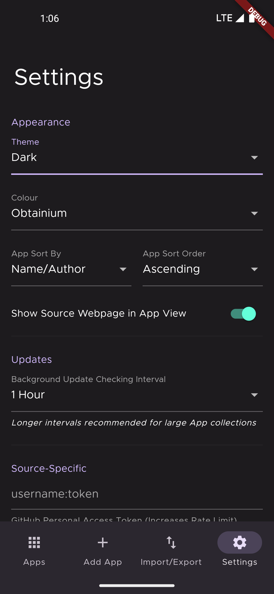
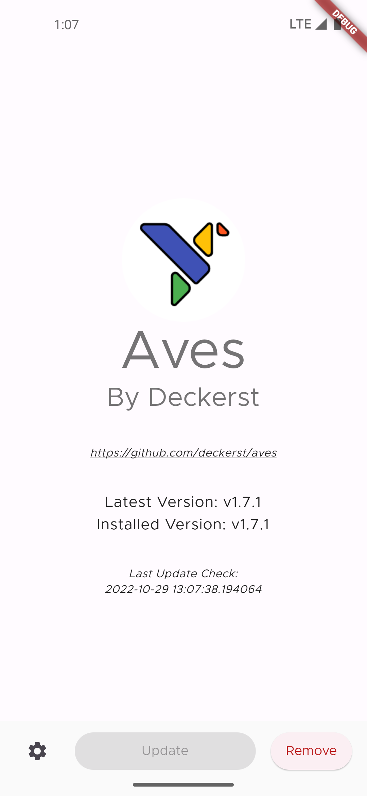

#  Obtainium

Get Android App Updates Directly From the Source.

Obtainium allows you to install and update Open-Source Apps directly from their releases pages, and receive notifications when new releases are made available.

Motivation: [Side Of Burritos - You should use this instead of F-Droid | How to use app RSS feed](https://youtu.be/FFz57zNR_M0)

Currently supported App sources:
- [GitHub](https://github.com/)
- [GitLab](https://gitlab.com/)
- [Codeberg](https://codeberg.org/)
- [F-Droid](https://f-droid.org/)
- [IzzyOnDroid](https://android.izzysoft.de/)
- [Mullvad](https://mullvad.net/en/)
- [Signal](https://signal.org/)
- [SourceForge](https://sourceforge.net/)
- [APKMirror](https://apkmirror.com/) (Track-Only)
- Third Party F-Droid Repos
- Jenkins Jobs
- [Steam](https://store.steampowered.com/mobile)
- [Telegram App](https://telegram.org)
- [VLC](https://www.videolan.org/vlc/download-android.html)
- [Neutron Code](https://neutroncode.com)
- "HTML" (Fallback)
  - Any other URL that returns an HTML page with links to APK files (if multiple, the last file alphabetically is picked)

## Installation

## Limitations
- Auto (unattended) updates are unsupported due to a lack of any capable Flutter plugin.
- For some sources, data is gathered using Web scraping and can easily break due to changes in website design. In such cases, more reliable methods may be unavailable.

## Screenshots

|  |            |     |
| ------------------------------------------------------ | ----------------------------------------------------------------------- | -------------------------------------------------------------------- |
|    |  |  |
