# ObtainX vs Obtainium – what's different and why it matters

## Contents

- [UI and feature comparisons](#ui-and-feature-comparisons)
  - [Home page and apps list](#home-page-and-apps-list)
  - [View options](#view-options)
  - [App filters](#app-filters)
  - [App details page](#app-details-page)
  - [Adding apps](#adding-apps)
    - [Paste a link](#adding-apps-paste-a-link)
    - [Search across stores](#adding-apps-search-across-stores)
    - [Bulk import device apps](#adding-apps-bulk-import-device-apps)
  - [Category management](#category-management)
  - [Settings](#settings)
  - [Tablets, foldables, and landscape layout](#tablets-foldables-and-landscape-layout)
- [ObtainX Exclusives](#obtainx-exclusives)
  - [Security features](#security-features)
  - [Bulk import device apps](#bulk-import-device-apps)
  - [Folders](#folders)
  - [On-Demand Only](#on-demand-only)
  - [Clearer app statuses](#clearer-app-statuses)
  - [Installer choice - why this fork exists](#installer-choice---why-this-fork-exists)
- [More features worth knowing](#more-features-worth-knowing)

## UI and feature comparisons

**Material 3 Expressive everywhere** – Full M3 Expressive treatment across every screen: cards, motion, sliders, and controls that feel like one coherent product across your app list, app details, adding apps, and settings. ObtainX adopted this in March 2026, well ahead of Obtainium's own Material 3 Expressive redesign in July 2026.

### Home page and apps list

<table>
    <tr><th width="26%">Feature</th><th width="37%">Obtainium</th><th width="37%">ObtainX</th></tr>
    <tr>
        <td>Navigation</td>
        <td>• No navigation bar or tabs. You have to return to homepage to go anywhere else. • Groups can be collapsed individually (no collapse-all) • Expanded/collapsed state is reset on every restart</td>
        <td>• Pinned navigation bar - switch to any tab from any tab • Groups can be collapsed individually or collapse-all • Every expanded/collapsed state is always remembered</td>
    </tr>
    <tr>
        <td>In-list live search</td>
        <td>Yes (added July 2026), but search bar scrolls away with apps list</td>
        <td>Yes (added March 2026), and search button stays pinned at the top</td>
    </tr>
    <tr>
        <td>Configurable per-row swipe actions</td>
        <td>Only 2 fixed actions (added July 2026); can be turned off, but not changed.</td>
        <td>Yes (added March 2026), and 8 actions to choose from, independently per side</td>
    </tr>
    <tr>
        <td>Ease of Update</td>
        <td>• Button at center of app row, can misalign per row. • Update-all button at the top of apps list • Updates scattered across individual groups</td>
        <td>• Button at right end, in perfect alignment • Update-all button at the bottom, within easy thumb reach • Unified Updates group at the top</td>
    </tr>
    <tr>
        <td>Category Visibility</td>
        <td>• Thin, side-by-side color strips. • Multiple categories overflow and blend together, making them difficult to distinguish.</td>
        <td>• Vertically stacked color bars ensure every category is distinct and fully visible. • Optional colored text chips inline on the app row so you don't have to memorize what each color means.</td>
    </tr>
</table>

<table>
    <tr>
        <td width="33%" align="center" valign="top">
            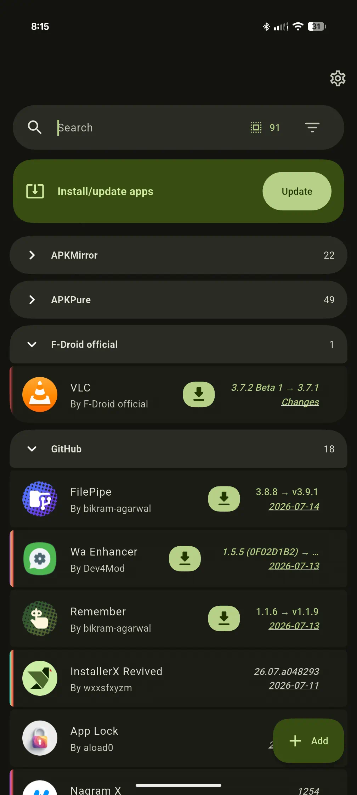 
            <strong>Obtainium</strong>
        </td>
        <td width="33%" align="center" valign="top">
             
            <strong>ObtainX</strong>
        </td>
        <td width="33%" align="center" valign="top">
            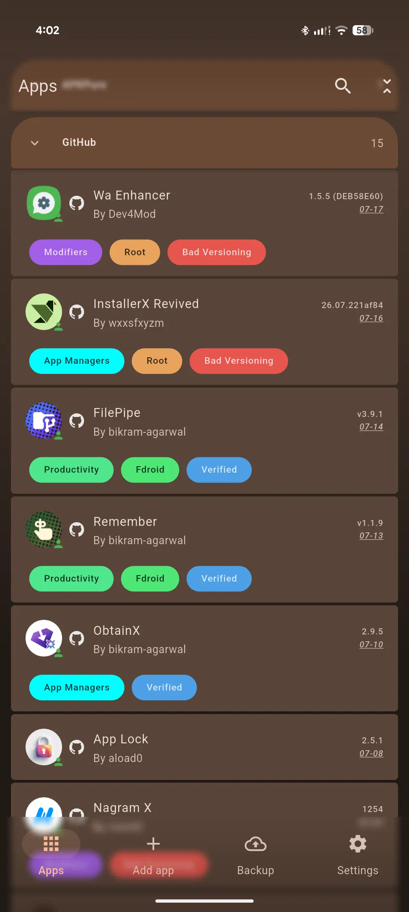 
            <strong>ObtainX</strong>
        </td>
    </tr>
</table>

---

### View options

Obtainium keeps sorting/grouping options in Settings tab. You have to keep switching between Apps page and settings page to finalize how you want it. 
ObtainX puts all sorting, grouping and view options in a sheet on the Apps tab itself — applied live while you watch the list.

<table>
    <tr><th width="40%">Feature</th><th width="30%">Obtainium</th><th width="30%">ObtainX</th></tr>
    <tr>
        <td>Where sort / group / view options live</td>
        <td>Settings tab</td>
        <td>Same apps tab</td>
    </tr>
    <tr>
        <td>Group by category</td>
        <td>Yes</td>
        <td>Yes</td>
    </tr>
    <tr>
        <td>Group by source</td>
        <td>✓ (added July 2026)</td>
        <td>✓ (added March 2026)</td>
    </tr>
    <tr>
        <td>Group by app type (user / system / privileged)</td>
        <td>✗</td>
        <td>✓</td>
    </tr>
    <tr>
        <td>Group updates separately</td>
        <td>✗</td>
        <td>✓</td>
    </tr>
    <tr>
        <td>Group non-installed apps separately</td>
        <td>✗</td>
        <td>✓</td>
    </tr>
    <tr>
        <td>Group track-only apps separately</td>
        <td>✗</td>
        <td>✓</td>
    </tr>
    <tr>
        <td>Show app-type / tracked-store / categories badges</td>
        <td>✗</td>
        <td>✓</td>
    </tr>
    <tr>
        <td>Per-folder view settings</td>
        <td>✗ (no folders)</td>
        <td>✓ Each folder remembers its own sort/group</td>
    </tr>
</table>

<table>
    <tr>
        <td width="50%" align="center" valign="top">
            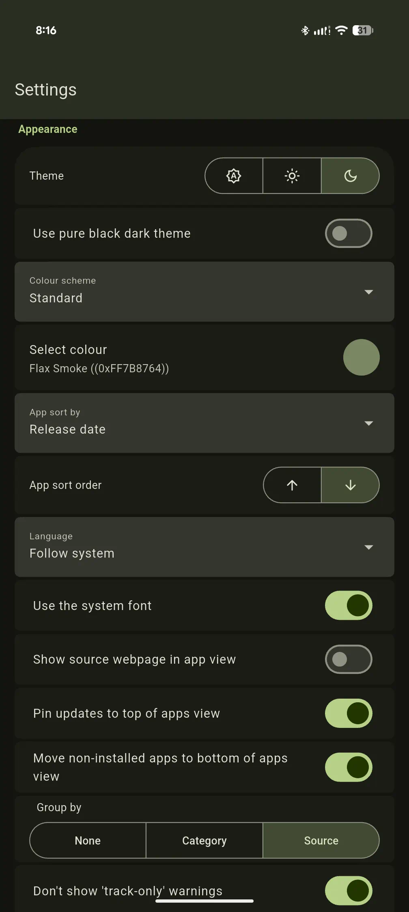 
            <strong>Obtainium</strong>
        </td>
        <td width="50%" align="center" valign="top">
             
            <strong>ObtainX</strong>
        </td>
    </tr>
</table>

---

### App filters

ObtainX's filters provide tri-state options (neutral/include/exclude) plus Any/All matching, and it reshapes the apps list in real time. Obtainium uses a submit-to-apply dialog with plain on/off toggles and include-only categories.

<table>
    <tr><th width="26%">Feature</th><th width="37%">Obtainium</th><th width="37%">ObtainX</th></tr>
    <tr>
        <td>Filter surface</td>
        <td>Centered floating panel that obscures the apps list</td>
        <td>Bottom sheet over the list, context stays visible</td>
    </tr>
    <tr>
        <td>Filtering results</td>
        <td>Set all filters, tap continue, dialog goes away, result is shown</td>
        <td>Apps list filters live as you tap any of the options</td>
    </tr>
    <tr>
        <td>Filtering options</td>
        <td>Plain on/off toggles</td>
        <td>Tri-state: neutral / include / exclude</td>
    </tr>
    <tr>
        <td>Category matching</td>
        <td>Shows apps that have any of the selected categories</td>
        <td>That + you can flip to show apps that have all of the selected categories</td>
    </tr>
    <tr>
        <td>Category exclusion</td>
        <td>✗</td>
        <td>✓</td>
    </tr>
    <tr>
        <td>Filter dismissal</td>
        <td>All or nothing</td>
        <td>Dismiss one filter at a time, or all at once</td>
    </tr>
    <tr>
        <td>Save filter as a folder</td>
        <td>✗ no folders</td>
        <td>✓ turns the active filter into a folder rule</td>
    </tr>
</table>

<table>
    <tr>
        <td width="50%" align="center" valign="top">
            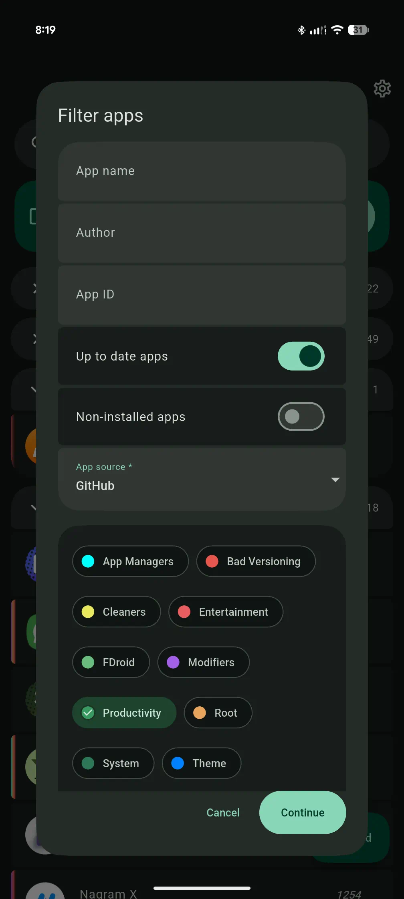 
            <strong>Obtainium</strong>
        </td>
        <td width="50%" align="center" valign="top">
             
            <strong>ObtainX</strong>
        </td>
    </tr>
</table>

---

### App details page

<table>
    <tr><th width="26%">Feature</th><th width="37%">Obtainium</th><th width="37%">ObtainX</th></tr>
    <tr>
        <td>Apps list → app detail</td>
        <td>App page slides in from right side</td>
        <td>App's row expands/morphs into the app page</td>
    </tr>
    <tr>
        <td>Page colors drawn from the app's icon</td>
        <td>✗</td>
        <td>✓</td>
    </tr>
    <tr>
        <td>Grouped info cards</td>
        <td>Yes (added July 2026)</td>
        <td>Yes (added Mar 2026)</td>
    </tr>
    <tr>
        <td>Version verdict</td>
        <td>Binary (update / up-to-date)</td>
        <td>6 distinct states</td>
    </tr>
    <tr>
        <td>Security features</td>
        <td>Shows certificate hash</td>
        <td>• Shows certificate hash • Verified build status • VirusTotal scan status • Block installation on security flag</td>
    </tr>
    <tr>
        <td>Show app type</td>
        <td>✗</td>
        <td>✓ User / system / privileged</td>
    </tr>
    <tr>
        <td>Verified other-store links</td>
        <td>✗</td>
        <td>✓ Play Store / F-Droid / APKPure / APKMirror</td>
    </tr>
    <tr>
        <td>Categories shown</td>
        <td>All categories - assigned and not assigned</td>
        <td>Shows only assigned categories, keeping the page clean</td>
    </tr>
    <tr>
        <td>App's information editing</td>
        <td>Combined with tracking configuration, opens a separate page</td>
        <td>Inline edit / save</td>
    </tr>
    <tr>
        <td>Change app icon</td>
        <td>✗</td>
        <td>✓</td>
    </tr>
    <tr>
        <td>App icon for non-installed apps</td>
        <td>✗ Only installed apps (from the device)</td>
        <td>✓ For stores that provide one — F-Droid (+repo), IzzyOnDroid, APKMirror, Tencent, Vivo, CoolApk</td>
    </tr>
    <tr>
        <td>Update size shown in advance</td>
        <td>Shown for most stores (added July 2026) — but not APKMirror</td>
        <td>Shown for those same stores (from May 2026) — and APKMirror too</td>
    </tr>
    <tr>
        <td>Skip version</td>
        <td>✗</td>
        <td>✓</td>
    </tr>
    <tr>
        <td>Changelog view</td>
        <td>• Centered, narrow panel squishes text vertically • Completely obscures the center of the screen • Doesn't show screenshots present in release notes • Can't fetch changelog from APKMirror apps</td>
        <td>• Full-width bottom sheet (wider, better readable text layout) • Keeps background app context visible • Shows screenshots present in release notes • Fetches changelog from APKMirror apps too</td>
    </tr>
    <tr>
        <td>Update check configuration</td>
        <td>Options mixed with app metadata editing, in a long list of options</td>
        <td>Only update related configurations, neatly grouped into separate sections for easier access</td>
    </tr>
</table>

<table>
    <tr>
        <td width="50%" align="center" valign="top">
            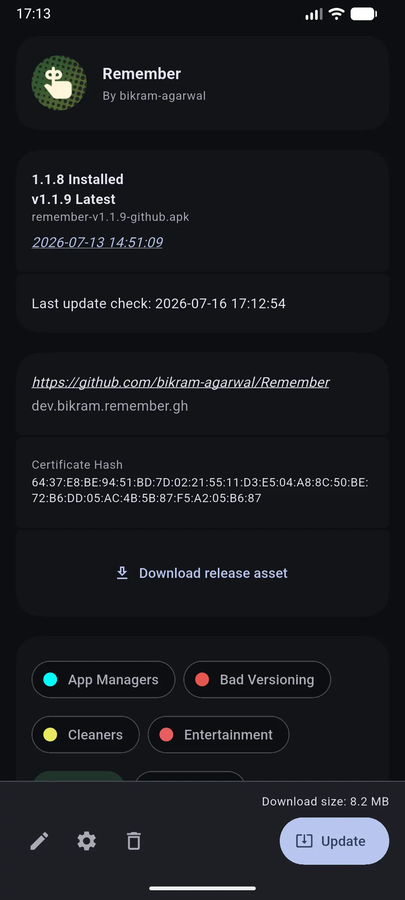 
            <strong>Obtainium</strong>
        </td>
        <td width="50%" align="center" valign="top">
             
            <strong>ObtainX</strong>
        </td>
    </tr>
    <tr>
        <td width="50%" align="center" valign="top">
            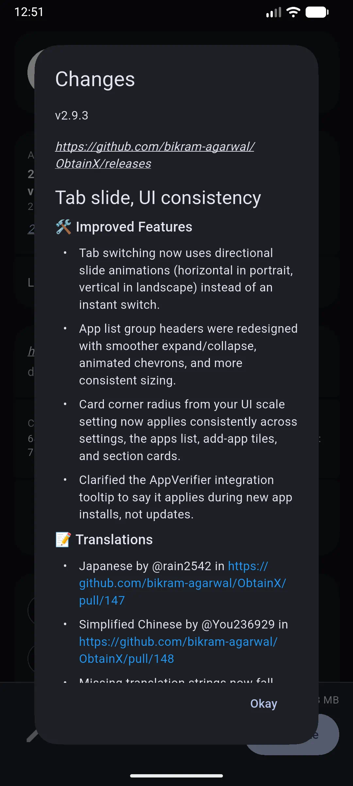 
            <strong>Obtainium</strong>
        </td>
        <td width="50%" align="center" valign="top">
            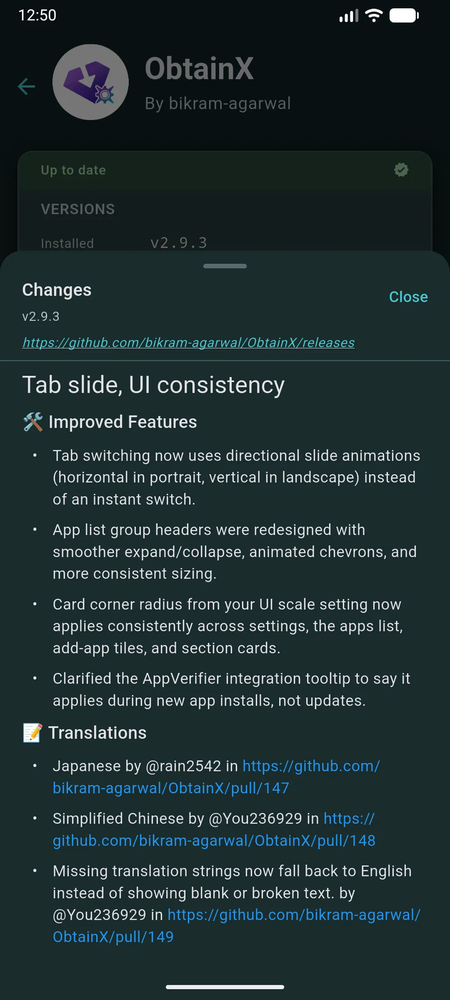 
            <strong>ObtainX</strong>
        </td>
    </tr>
    <tr>
        <td width="50%" align="center" valign="top">
            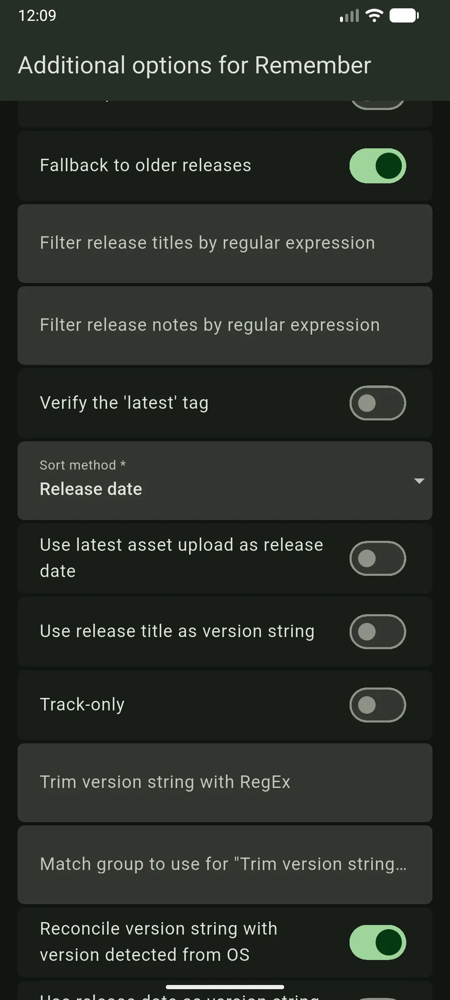 
            <strong>Obtainium</strong>
        </td>
        <td width="50%" align="center" valign="top">
            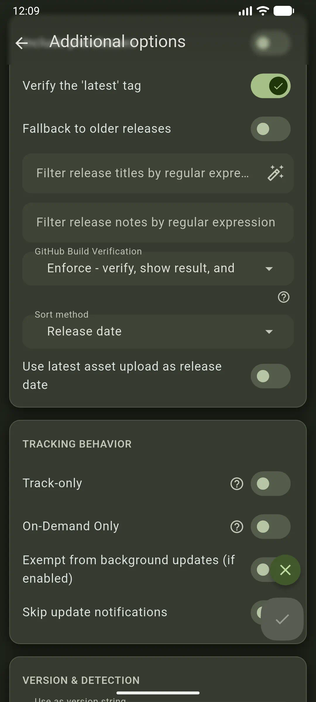 
            <strong>ObtainX</strong>
        </td>
    </tr>
</table>

---

### Adding apps

Obtainium's Add page is a single pushed screen: a URL field with an **Add** button, one **Search** bar, and a few import tiles below. ObtainX turns Add into its own tab — a launcher of distinct ways new apps can be added (paste a URL, two separate search modes, bulk import of on-device apps, and the imports), which splits into two panes on large screens. Several entry points are now common to both apps; the table calls out where they genuinely differ.

<table>
    <tr><th width="35%">Feature</th><th width="32%">Obtainium</th><th width="32%">ObtainX</th></tr>
    <tr>
        <td>Add a source by URL</td>
        <td>✓</td>
        <td>✓</td>
    </tr>
    <tr>
        <td>Search across sources to add one app</td>
        <td>✓</td>
        <td>✓</td>
    </tr>
    <tr>
        <td>Search one source and batch-add many apps</td>
        <td>✗ (dropped in July 2026)</td>
        <td>✓ Still available</td>
    </tr>
    <tr>
        <td>Bulk-import installed device apps</td>
        <td>✗</td>
        <td>✓</td>
    </tr>
    <tr>
        <td>Import from a URL list</td>
        <td>✓</td>
        <td>✓</td>
    </tr>
    <tr>
        <td>Import GitHub starred repositories</td>
        <td>✓</td>
        <td>✓</td>
    </tr>
    <tr>
        <td>Import from backup file</td>
        <td>✓ on the Add screen</td>
        <td>✓ on a dedicated Backup tab</td>
    </tr>
    <tr>
        <td>Supported-sources reference</td>
        <td>"Supported sources" button at bottom</td>
        <td>Via the ⓘ button on the URL field</td>
    </tr>
    <tr>
        <td>Crowdsourced app configurations</td>
        <td>✓</td>
        <td>✓</td>
    </tr>
    <tr>
        <td>Large-screen layout</td>
        <td>Full-screen page</td>
        <td>Two-pane — the chosen entry opens in the right pane</td>
    </tr>
</table>

<table>
    <tr>
        <td width="50%" align="center" valign="top">
            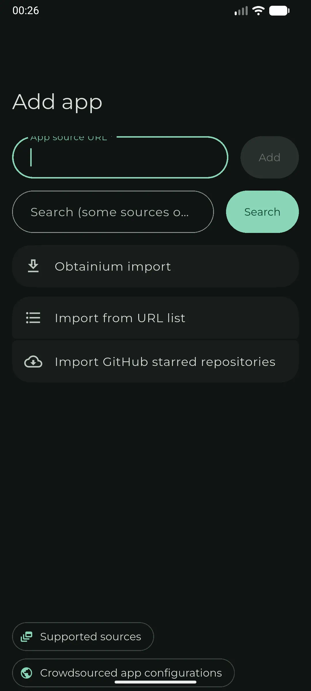 
            <strong>Obtainium</strong>
        </td>
        <td width="50%" align="center" valign="top">
            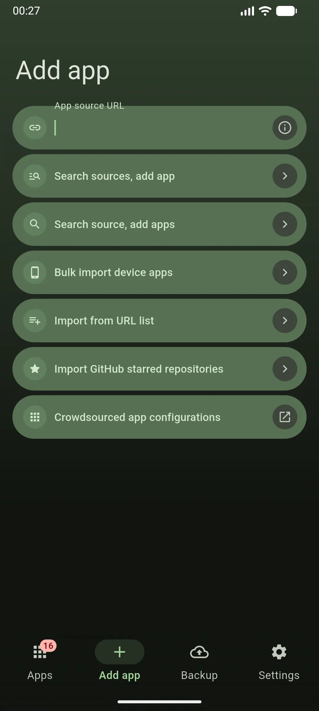 
            <strong>ObtainX</strong>
        </td>
    </tr>
</table>

### Adding apps: paste a link

ObtainX groups a source's additional options into labeled section cards, so that it's easier to eyeball and quickly find the one you want to change. It also offers a built-in RegEx helper for some fields. Obtainium renders the same options as one flat form with no helper.

<table>
    <tr><th width="35%">Feature</th><th width="32%">Obtainium</th><th width="32%">ObtainX</th></tr>
    <tr>
        <td>Additional options grouped into labeled cards</td>
        <td>✗ one flat form</td>
        <td>✓ sectioned cards with headers</td>
    </tr>
    <tr>
        <td>Built-in Regular Expression helper</td>
        <td>✗</td>
        <td>✓ Guided RegEx builder on filter fields</td>
    </tr>
    <tr>
        <td>How to save</td>
        <td>Scroll to the top of page, tap fixed Add button.</td>
        <td>From anywhere on screen, tap the floating Save button.</td>
    </tr>
</table>

<table>
    <tr>
        <td width="50%" align="center" valign="top">
            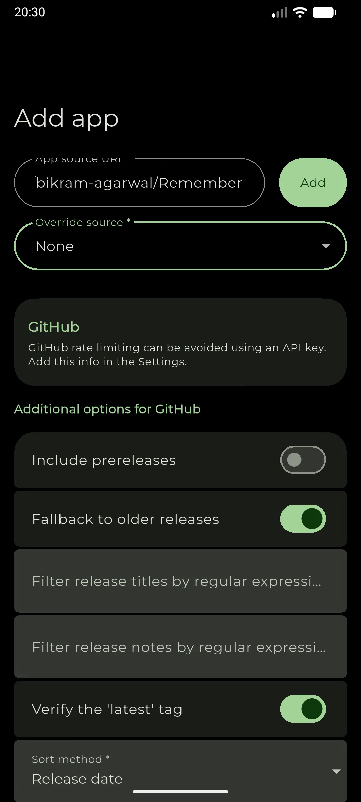 
            <strong>Obtainium (AMOLED)</strong>
        </td>
        <td width="50%" align="center" valign="top">
            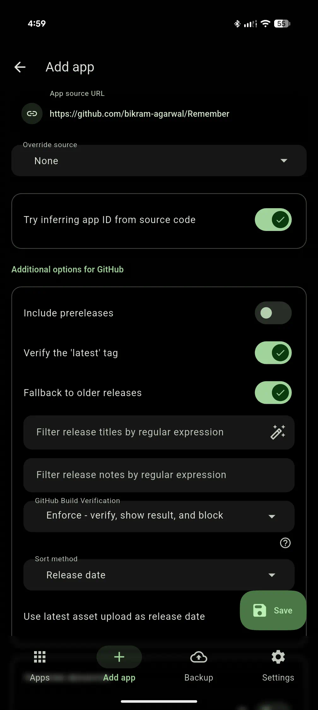 
            <strong>ObtainX (AMOLED)</strong>
        </td>
    </tr>
</table>

### Adding apps: search across stores

ObtainX searches 9 stores (3 more than Obtainium), shows them all as chips upfront, shows the result on the same page with each result showing store badge. You can also change store selection afterwards and re-search without leaving the page; Obtainium searches 6 stores through a two-dialog flow with no store badges on results.

<table>
    <tr><th width="26%">Feature</th><th width="37%">Obtainium</th><th width="37%">ObtainX</th></tr>
    <tr>
        <td>Searchable sources</td>
        <td>6 — GitHub, GitLab, Codeberg, F-Droid, F-Droid repo, Vivo App Store</td>
        <td>9 — those 6 <strong>plus</strong> IzzyOnDroid, CoolApk, Tencent</td>
    </tr>
    <tr>
        <td>All sources visible upfront</td>
        <td>✗ Sources picked in a dialog after tapping Search</td>
        <td>✓ Source chips shown before searching</td>
    </tr>
    <tr>
        <td>Switch source & re-search inline</td>
        <td>✗ Dismiss result and start fresh search</td>
        <td>✓ Toggle chips, search re-runs in place</td>
    </tr>
    <tr>
        <td>Per-result source badge</td>
        <td>✗ For each result, read source name sandwitched between app name and description</td>
        <td>✓ Source icon on each result. Super easy to parse.</td>
    </tr>
    <tr>
        <td>Bulk add from results</td>
        <td>✗ (dropped in July 2026)</td>
        <td>✓ Still available</td>
    </tr>
</table>

<table>
    <tr>
        <td width="50%" align="center" valign="top">
            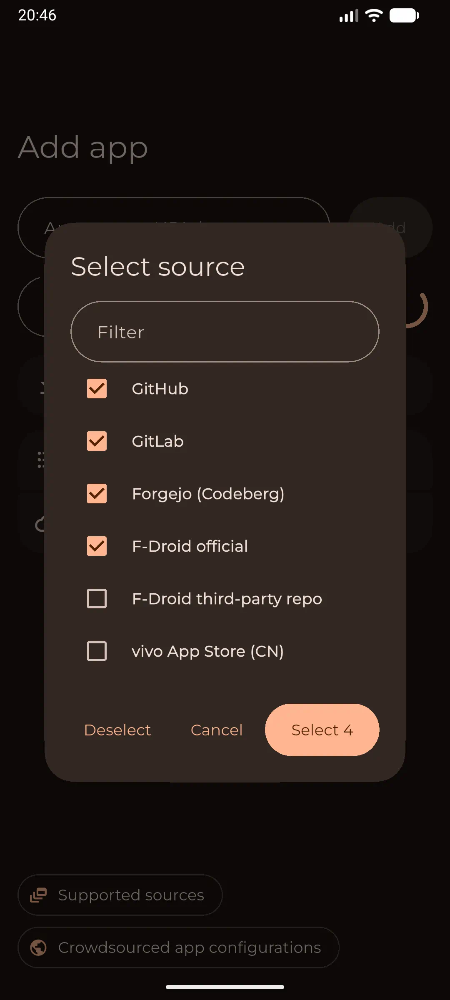 
            <strong>Obtainium</strong>
        </td>
        <td width="50%" align="center" valign="top">
            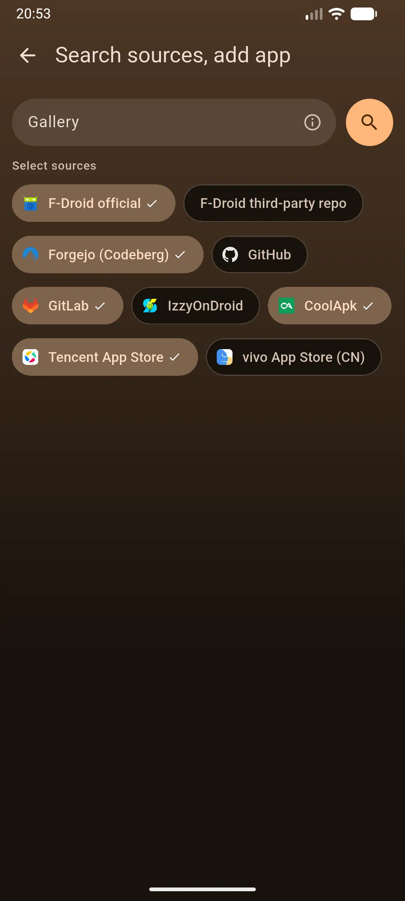 
            <strong>ObtainX</strong>
        </td>
    </tr>
    <tr>
        <td width="50%" align="center" valign="top">
            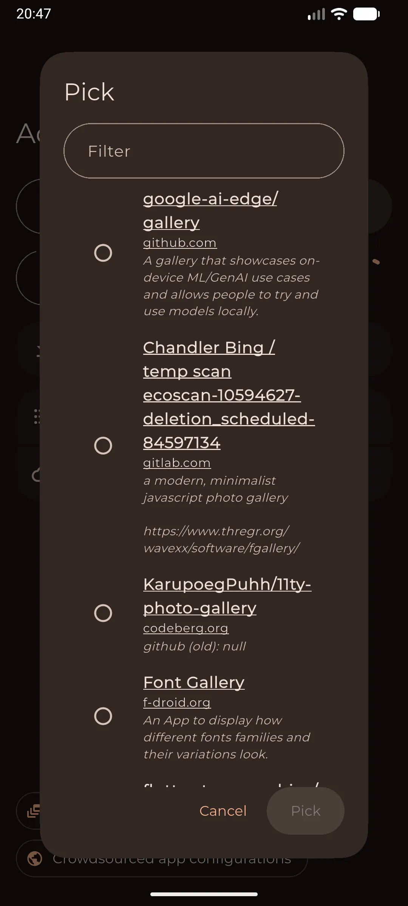 
            <strong>Obtainium</strong>
        </td>
        <td width="50%" align="center" valign="top">
            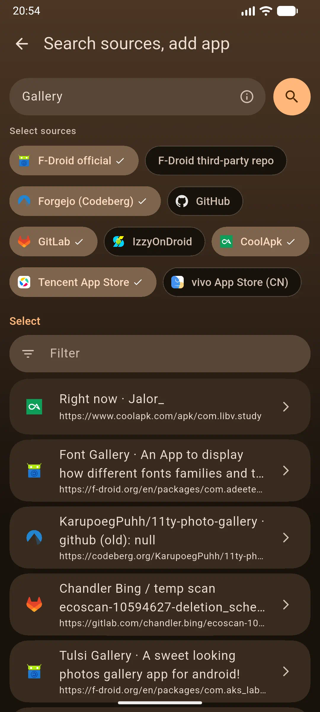 
            <strong>ObtainX</strong>
        </td>
    </tr>
</table>

### Adding apps: bulk import device apps

This is an ObtainX exclusive feature. [Check it out below](#bulk-import-device-apps).

---

### Category management

Both now support exact color pick and rename-with-propagation; ObtainX adds contrast-aware labels, a merge-based bulk editor, a tri-state filter and on-row chips.

<table>
    <tr><th width="26%">Feature</th><th width="37%">Obtainium</th><th width="37%">ObtainX</th></tr>
    <tr>
        <td>Color choices</td>
        <td>Presets + HSL color wheel (Hue & Saturation) (added June 2026)</td>
        <td>Linear color slider + hex input for exact color you want (added May 2026)</td>
    </tr>
    <tr>
        <td>Rename with propagation to all apps</td>
        <td>Yes (added July 2026)</td>
        <td>Yes (added May 2026)</td>
    </tr>
    <tr>
        <td>Automatic contrast label text</td>
        <td>✗</td>
        <td>✓ black/white by luminance</td>
    </tr>
    <tr>
        <td>Bulk category edit</td>
        <td>Replaces all assigned categories</td>
        <td>✓ merges — tri-state all/some/none, add or remove without wiping others</td>
    </tr>
    <tr>
        <td>Category filter</td>
        <td>Include-only, shows apps that have "any" of them</td>
        <td>✓ include / exclude, Any or All</td>
    </tr>
</table>

<table>
    <tr>
        <td width="66%" align="center" valign="top">
            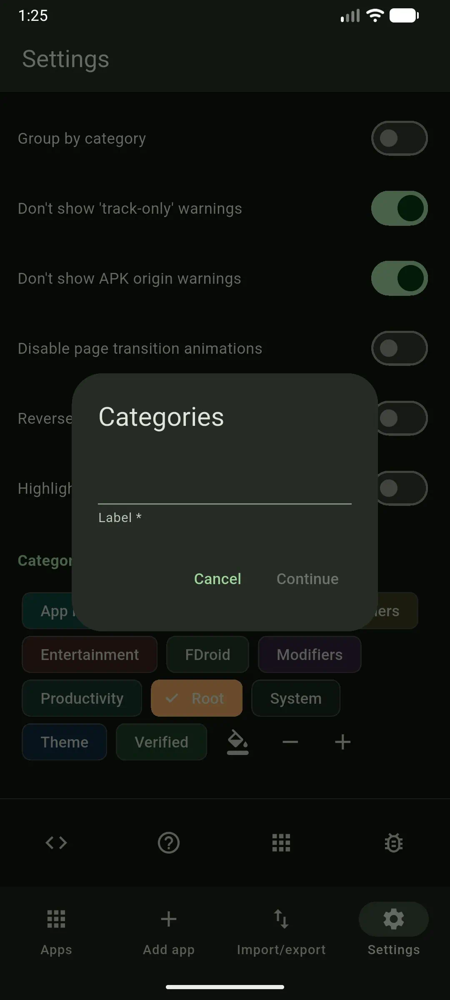 
            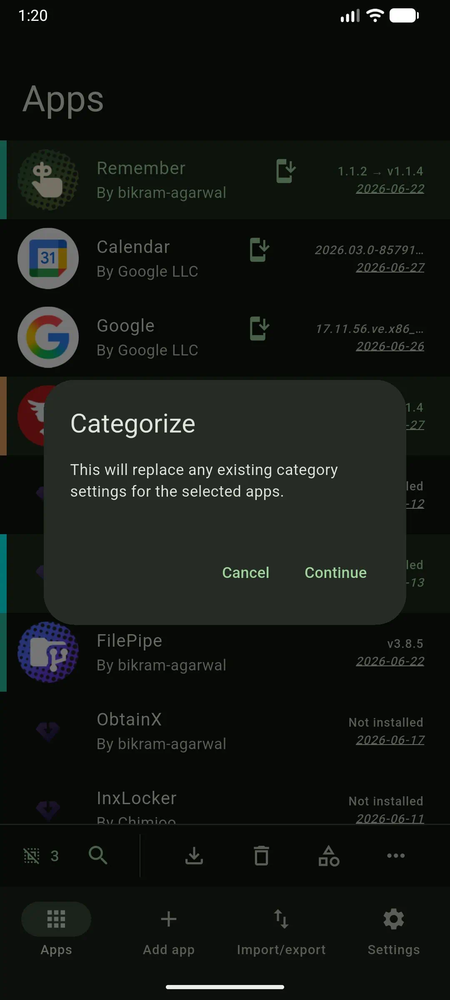 
            <strong>Obtainium</strong>
        </td>
        <td width="33%" align="center" valign="top">
            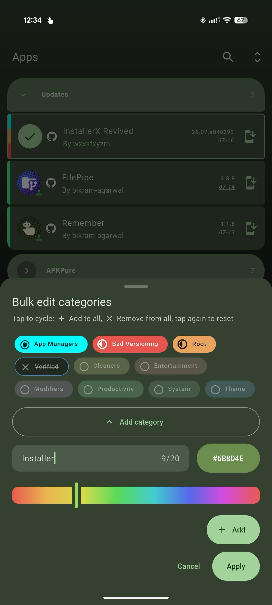 
            <strong>ObtainX</strong>
        </td>
    </tr>
</table>

---

### Settings

<table>
    <tr><th width="26%">Feature</th><th width="37%">Obtainium</th><th width="37%">ObtainX</th></tr>
    <tr>
        <td>Card-based settings grouping</td>
        <td>Yes (added July 2026)</td>
        <td>Yes (added March 2026), more granular</td>
    </tr>
    <tr>
        <td>Material 3 Expressive sliders / controls</td>
        <td>Yes (added July 2026)</td>
        <td>Yes (added March 2026)</td>
    </tr>
    <tr>
        <td>Collapsible sections (independent + collapse-all)</td>
        <td>✗ always expanded</td>
        <td>✓ collapse selectively or all, state persisted</td>
    </tr>
    <tr>
        <td>Theme options</td>
        <td>• System, light, dark, black • Standard, Vibrant, Expressive, Material You • HSL color wheel to choose theme color</td>
        <td>• System, light, dark, AMOLED • 9 palette styles • Material You + 10 preset color + hue slider + hex input for exact color of your choice • Control color shading intensity • Gradient background instead of static color • Frosted glass progressive blur effect • Control card corner roundness</td>
    </tr>
</table>

<table>
    <tr>
        <td width="50%" align="center" valign="top">
            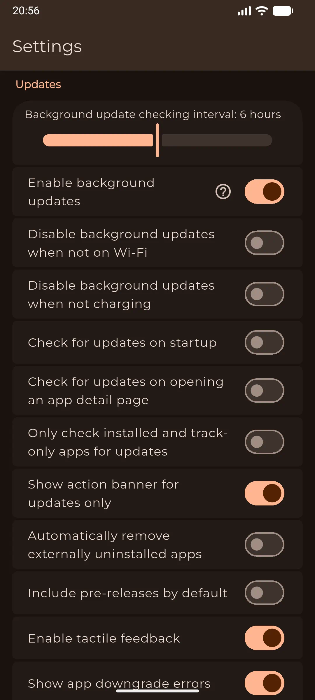 
            <strong>Obtainium</strong>
        </td>
        <td width="50%" align="center" valign="top">
            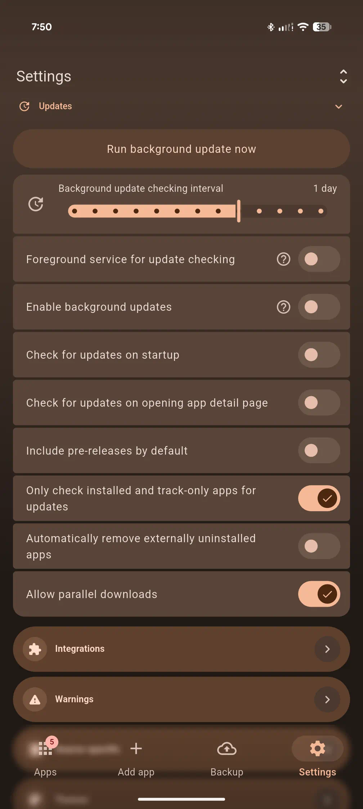 
            <strong>ObtainX</strong>
        </td>
    </tr>
</table>

---

### Tablets, foldables, and landscape layout

ObtainX pioneered the large-screen layout (v2.9.0, June 2026); Obtainium added a two-pane apps list shortly after (v1.6.0, July 2026) — but that one screen is the extent of its tablet support.

<table>
    <tr><th width="35%">Feature</th><th width="32%">Obtainium</th><th width="32%">ObtainX</th></tr>
    <tr>
        <td>Landscape / foldable / large-phone support</td>
        <td>Two-pane at width ≥ 840 only</td>
        <td>✓ full adaptive layout</td>
    </tr>
    <tr>
        <td>Two-pane apps list + detail</td>
        <td>Yes (added July 2026)</td>
        <td>Yes (added June 2026)</td>
    </tr>
    <tr>
        <td>Persistent side navigation rail</td>
        <td>✗ (no nav rail anywhere)</td>
        <td>✓ persistent left rail across screens</td>
    </tr>
    <tr>
        <td>Add-app adapts to big screen</td>
        <td>✗ phone layout</td>
        <td>✓ two panels</td>
    </tr>
    <tr>
        <td>Settings adapts to big screen</td>
        <td>✗ one long scroll even on tablets</td>
        <td>✓ two panels - categories left, options right</td>
    </tr>
</table>

<table>
    <tr>
        <td width="50%" align="center" valign="top">
            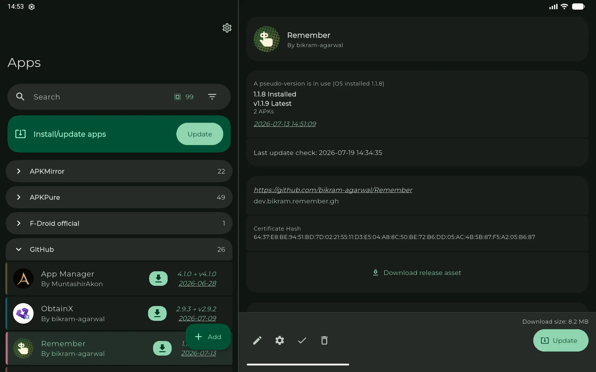 
            <strong>Obtainium - apps list</strong>
        </td>
        <td width="50%" align="center" valign="top">
             
            <strong>ObtainX - apps list</strong>
        </td>
    </tr>
    <tr>
        <td width="50%" align="center" valign="top">
            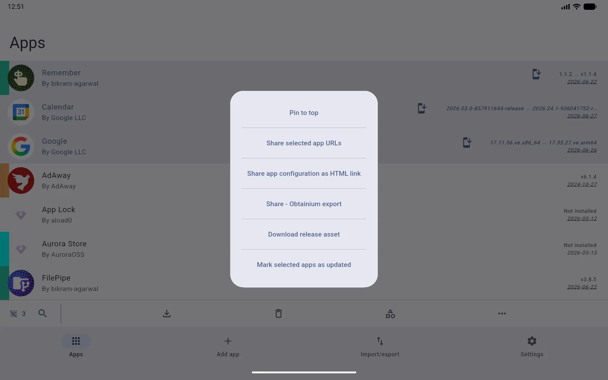 
            <strong>Obtainium - multi-select & batch actions</strong>
        </td>
        <td width="50%" align="center" valign="top">
            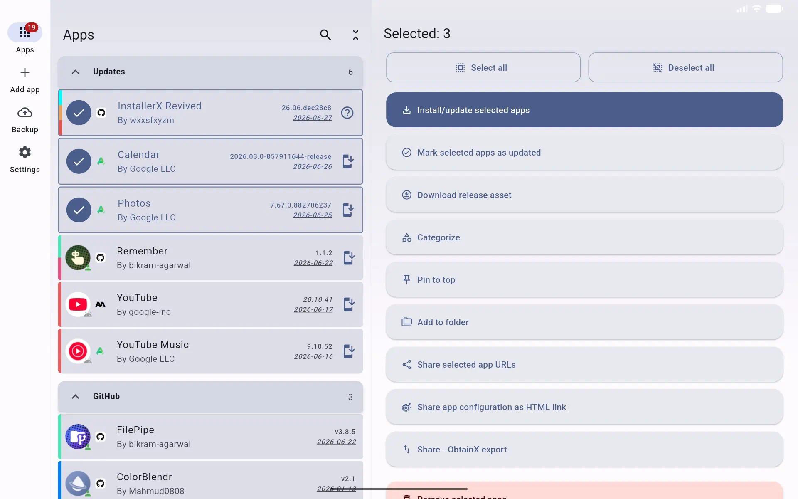 
            <strong>ObtainX - multi-select & batch actions</strong>
        </td>
    </tr>
    <tr>
        <td width="50%" align="center" valign="top">
            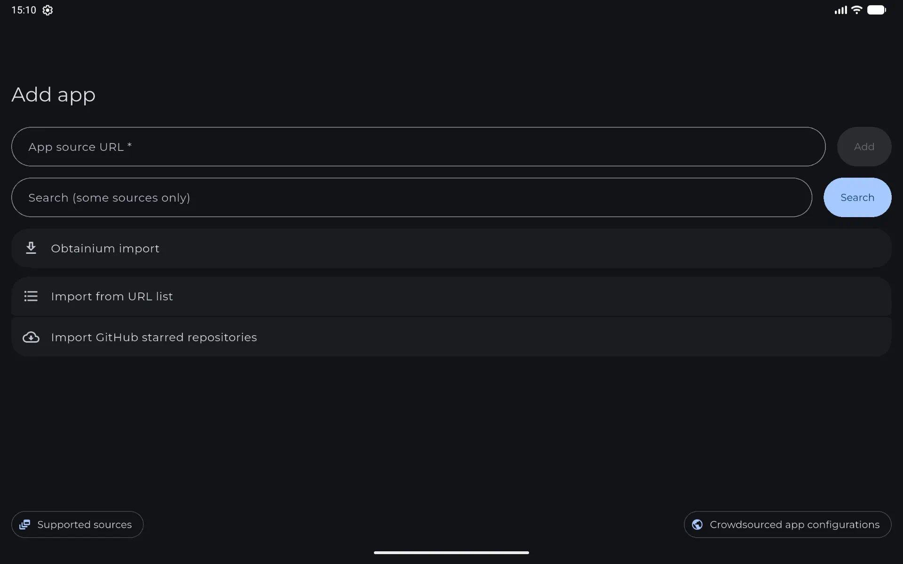 
            <strong>Obtainium - add app</strong>
        </td>
        <td width="50%" align="center" valign="top">
             
            <strong>ObtainX - add app</strong>
        </td>
    </tr>
    <tr>
        <td width="50%" align="center" valign="top">
            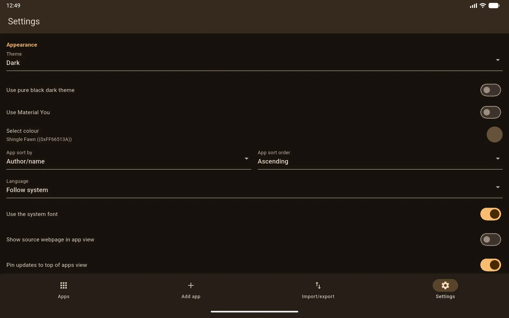 
            <strong>Obtainium - Settings - one long page</strong>
        </td>
        <td width="50%" align="center" valign="top">
             
            <strong>ObtainX - Settings - grouped sections</strong>
        </td>
    </tr>
</table>

---
## ObtainX Exclusives

### 🛡️ Security features

Obtainium pulls each APK straight off the open internet — a GitHub asset, an F-Droid mirror, a third-party store, sometimes a plain HTML page — and its only integrity signal is the **signing-certificate hash**, which merely says the *signer* hasn't changed. It tells you nothing about whether the bytes match what the developer actually built, or whether the file is malicious. That leaves **you** as the last line of defense. ObtainX adds two independent layers, either of which can hard-block an install:

- **Build verification — "is this the developer's real build?"** ObtainX confirms the exact file you downloaded against **reproducible-build** proof (F-Droid / IzzyOnDroid rebuild the app from public source and match it) or a **GitHub Release Attestation** (GitHub's signed record that the file came out of the developer's own CI — not swapped in by a hijacked account, CDN, or man-in-the-middle). Configurable per app as **Off / Audit-only / Enforce**, where Enforce blocks anything unverified. This is exactly the signal that catches a *trusted* app whose release pipeline was later compromised — Obtainium has neither check. *(See the [Build Verification Guide](build-verification-guide.md).)*
- **VirusTotal scanning — "is this file known-bad?"** With your own API key, ObtainX scans every downloaded APK against VirusTotal's dozens of engines **before install**. Flagged or failed scans **fail safe**: a manual install stops and asks you (view report / cancel / install anyway), and a background update skips the app and notifies you instead of installing silently.

The two are complementary — a reproducible build proves authenticity, but an authentic build of a *malicious* app still passes, and that's what VirusTotal catches. ObtainX's own releases are reproducible and attested too, so the updater itself is verifiable by the same checks.

---

### Bulk import device apps

Obtainium let you add apps by searching by name — pick a store, search, pick from results. That works fine for one app. But if you want to track 50 apps, you do that 50 times. 100 apps? 100 times. There's no shortcut.

ObtainX has the shortcut.

**Select your apps. Hit scan. Done.**

ObtainX reads every app installed on your device, searches each of your chosen stores in turn — F-Droid, Izzy, GitHub APKPure, APKMirror — and comes back with a ready-to-go list of what it found and where. The whole thing — scanning 200 apps across four stores — takes a few minutes and zero manual effort. You can add your entire library in one shot.

<table>
    <tr>
        <td width="50%" align="center" valign="top">
             
            <strong>Select</strong> Filter by app type, pick your stores, toggle Skip tracked / Skip privileged, search, select all or hand-pick.
        </td>
        <td width="50%" align="center" valign="top">
            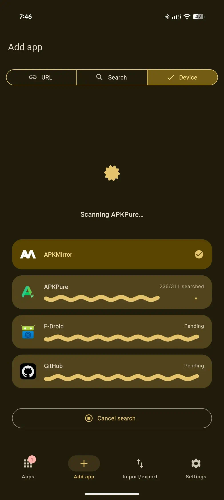 
            <strong>Scan</strong> Stores are searched, with live per-store progress. Results are cached — repeat scans skip what's already known.
        </td>
    </tr>
    <tr>
        <td width="50%" align="center" valign="top">
            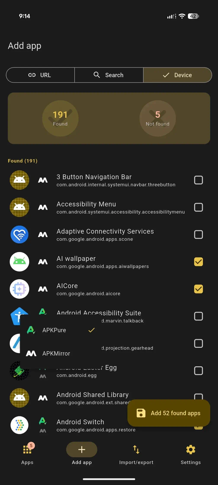 
            <strong>Review</strong> Found / Not found summary at a glance. Each result shows which store(s) it was found on. Uncheck anything you don't want.
        </td>
        <td width="50%" align="center" valign="top">
            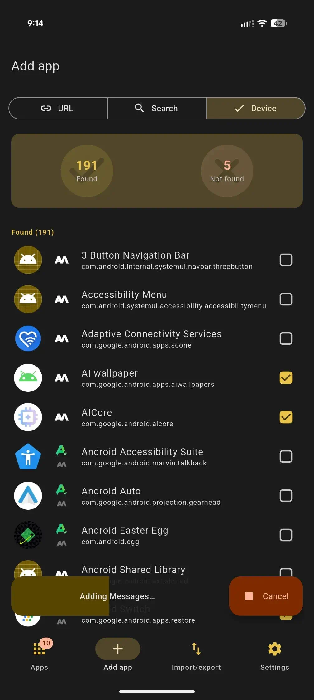 
            <strong>Add</strong> Tap "Add N found apps." Live progress as they're added. Cancel any time.
        </td>
    </tr>
</table>

---

### Folders

Obtainium has one singular home for all your apps. Once you're tracking 30+ apps it becomes hard to navigate — even with grouping, everything is on one page.

ObtainX adds **Folders**: persistent named views that pull apps off the main list and give them their own separate page, reacheable via button at the bottom of the Apps page. The main list shows only apps that don't belong to any folder, so it stays focused.

**How folders work:**
- **Rule-based** — Set a match rule (field: name, author, source, category, state: installed or not, up-to-date or not etc.) and ObtainX auto-assigns every matching app to the folder, including any new apps you add later.
- **Manual** — Long-press one or more apps and tap the folder icon in the multi-select toolbar to assign them directly.
- **Mixed** — A folder can have a rule for new apps and still accept manual additions.
- **Exclusions** — If you manually remove an app from a rule-based folder, it's excluded and the rule won't re-add it. Manually adding it back clears the exclusion.
**Per-folder view settings** — Each folder (and the On-Demand Only page) remembers its own sort column, group-by mode, pinned state, and filter — completely independent from the main list and from each other.

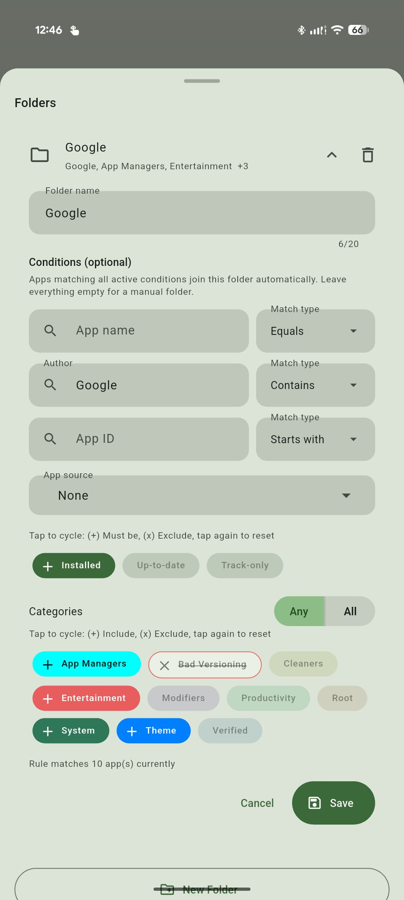

---

### On-Demand Only

Obtainium checks every tracked app on its refresh schedule — every hour, every few hours, however you've set it. That's fine for most apps, but some you simply don't need polled constantly.

ObtainX lets you mark individual apps as **On-Demand Only**. Apps with this flag are completely skipped during automatic background refreshes. They live on their own dedicated special folder — always visible when you want them, never adding noise to your main update count when you don't. When you're ready to check one, you check it. Not before.

**Why it matters:**

- **Apps that rarely change** — Niche tools, archived apps, or anything that updates in a long while. No point waking your phone for them every hour.
- **Apps you want full control over** — If you prefer to audit what's being updated rather than letting the background refresh decide for you, move those apps here and update them deliberately.
- **Reduce background noise** — Fewer background checks means fewer notifications, less network use, and a quieter update count badge on the main list.

---

### Clearer app statuses

ObtainX surfaces **finer-grained states** rather than forcing every situation into a binary "update / up to date" answer.

<table>
    <tr>
        <td width="33%" align="center" valign="top">
            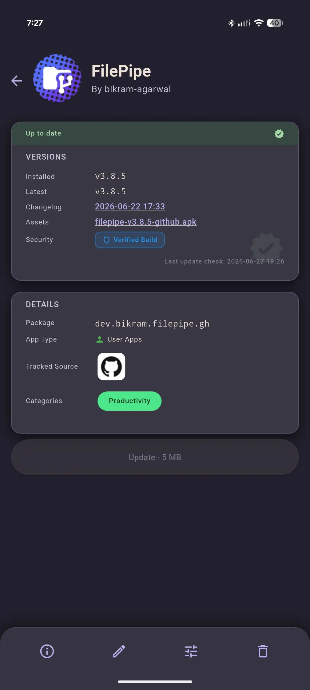 
            <strong>Up to date</strong> 
            What's on your device matches what the source is offering — you're current.
        </td>
        <td width="33%" align="center" valign="top">
             
            <strong>Update available</strong> 
            The source has a newer version than what's installed — time to update.
        </td>
        <td width="33%" align="center" valign="top">
            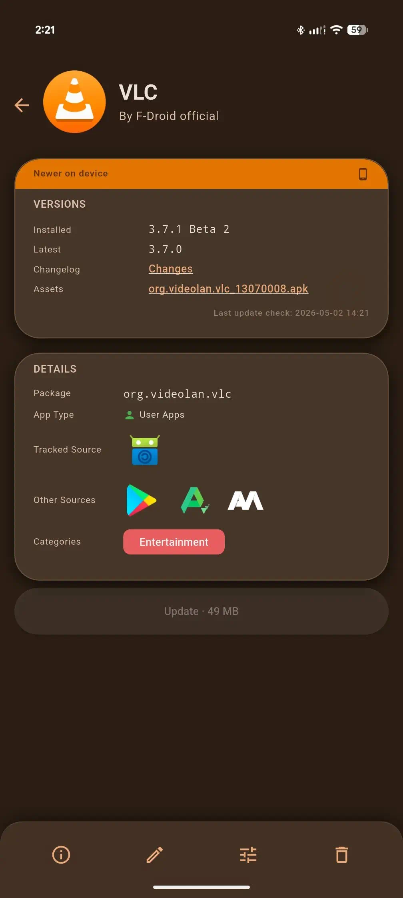 
            <strong>Device has a higher version</strong> 
            Your installed version is ahead of what the source advertises. Common with betas, sideloads, or sources that lag behind the actual release — shown correctly rather than flagged as a false update.
        </td>
    </tr>
    <tr>
        <td width="33%" align="center" valign="top">
            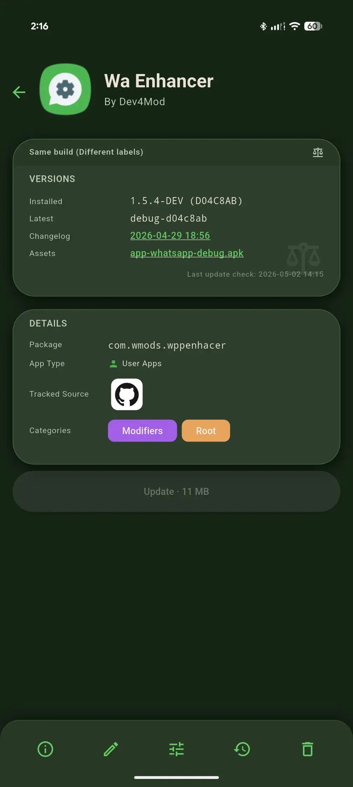 
            <strong>Same version, shown differently</strong> 
            The version is the same, but the text from the source and from Android don't match exactly. ObtainX recognizes this and doesn't send you chasing an "update" that isn't really one.
        </td>
        <td width="33%" align="center" valign="top">
            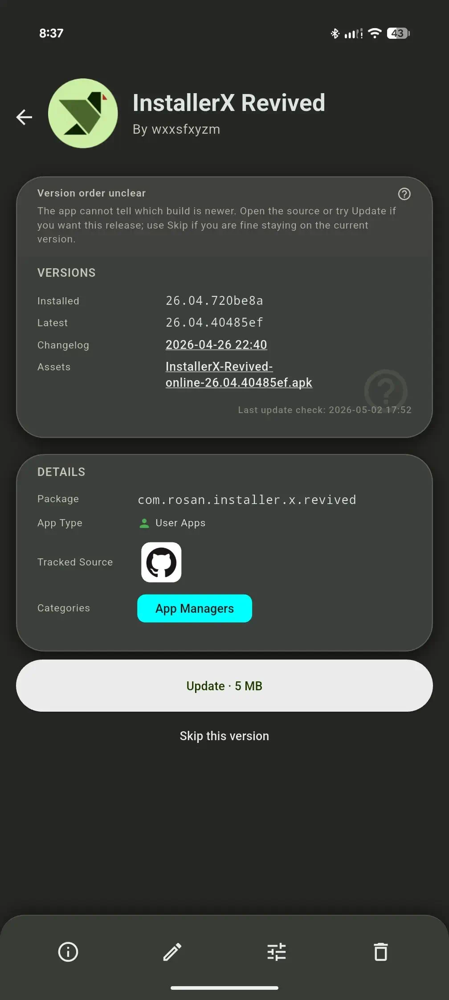 
            <strong>Genuinely unclear</strong> 
            Sometimes two versions can't be fairly compared — for example when a developer labels releases with commit hashes instead of version numbers. Rather than guessing, ObtainX says so and lets you check for yourself or skip it.
        </td>
        <td width="33%" align="center" valign="top">
            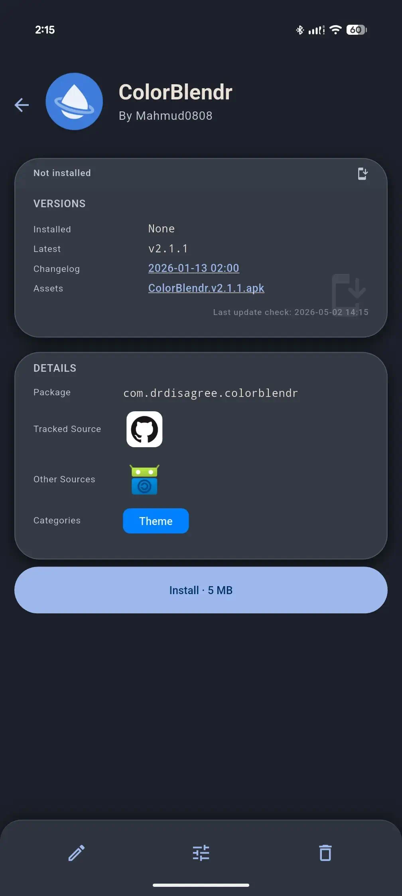 
            <strong>App not installed</strong> 
            This app is currently not installed on you device. Tip: if ObtainX somehow fetched a wrong package id when you added the app, that will cause it say "App not installed". In that case, you can click edit and fix the package id. 
        </td>
    </tr>
</table>

---

<b>Installer choice - why this fork exists</b>

  
  > **This is the feature that started everything.**
  
  Obtainium installs APKs itself, through the standard Android package installer. That's fine for most people — but there are two very different reasons you might want something else.
  
  **Reason 1: You care about what you're installing.**
  
  Third-party installers like [InstallerX](https://github.com/MuntashirAkon/InstallerX) show you things the stock installer doesn't: the APK's version number, its minimum and target API levels, whether those levels changed from your currently installed version, and a range of install options the standard path simply doesn't expose. [App Manager](https://github.com/MuntashirAkon/AppManager) goes further and surfaces any trackers bundled in the APK before you commit to installing it. If you want to know what you're actually installing rather than just tapping through a system dialog, these tools give you that visibility — which Obtainium couldn't offer when ObtainX built this.
  
  **Reason 2: Advanced Protection blocks sideloading.**
  
  Android's Advanced Protection mode is one of the strongest security configurations available. Among other things, it restricts the standard sideload install path that Obtainium uses. So every update becomes a three-step routine:
  
  1. Disable Advanced Protection
  2. Install the update
  3. Re-enable Advanced Protection
  
  Step three is easy to forget. Your phone silently sits in a weaker state until you remember.
  
  InstallerX and similar tools can be granted elevated install permissions via root or ADB, allowing them to install APKs even with Advanced Protection active. They're purpose-built for exactly this — but Obtainium had no way to hand off to them.
  
  **ObtainX solves both.** You pick your installer. ObtainX fetches the APK and passes it to whichever installer you've configured. You get the visibility and control of a proper installer tool, and Advanced Protection stays on.
  
  A pull request with this feature was submitted to Obtainium — it wasn't merged. While waiting, there were other rough edges worth fixing. Then a few more. That compounding list of improvements is what became ObtainX. 
  
  Obtainium has since added its own installer-handoff option in v1.6.0, July 2026 — months after ObtainX shipped installer choice in March 2026. Thus this feture is no longer exclusive to ObtainX.

---

## More features worth knowing

Check out the [README](../README.md) doc for full list of extra fetures.
