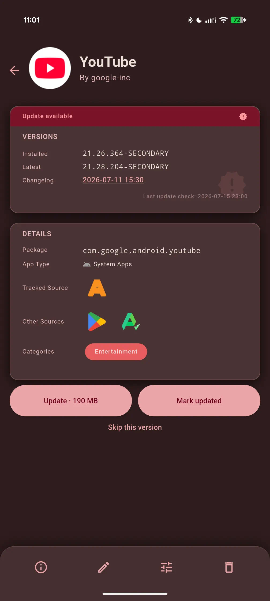
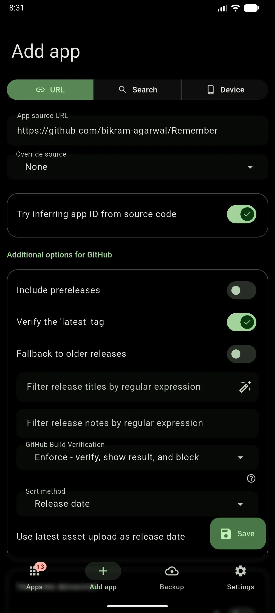
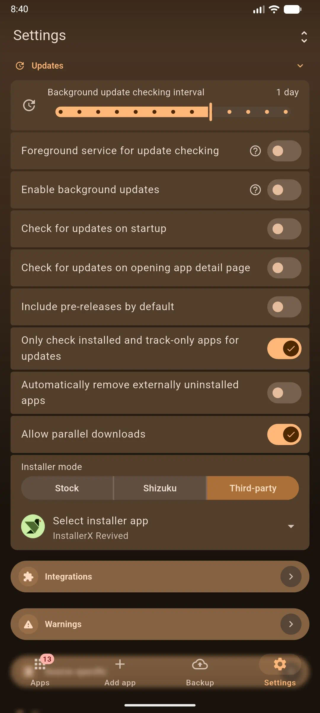
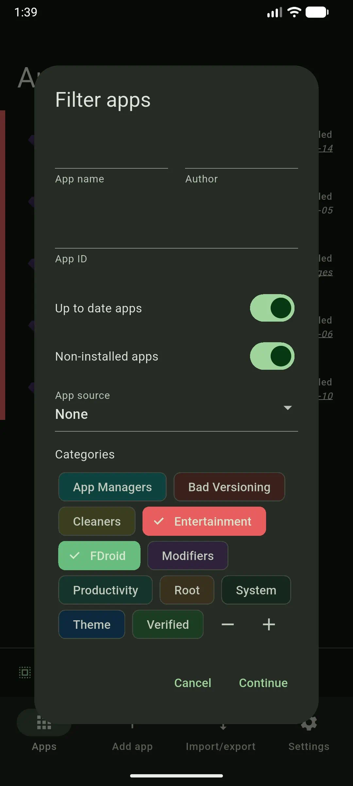
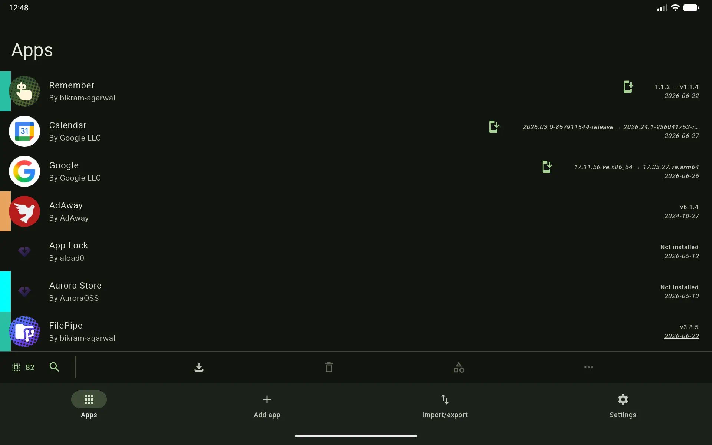
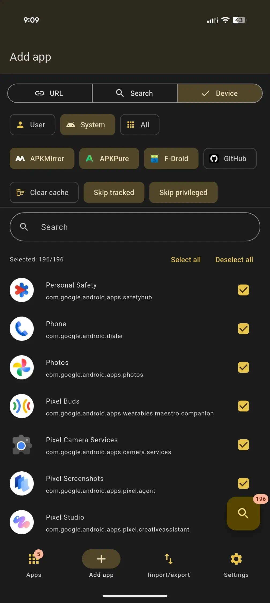

# ObtainX vs Obtainium – what's different and why it matters

## Contents

- [UI comparisons](#ui-comparisons)
  - [Your apps list – cards, grouping, and swipe gestures](#your-apps-list--cards-grouping-and-swipe-gestures)
  - [Themes and view options – on the Apps tab, where you use them](#themes-and-view-options--on-the-apps-tab-where-you-use-them)
  - [Filters – type and watch the list breathe](#filters--type-and-watch-the-list-breathe)
  - [App detail – verdict first, beauty that scales](#app-detail--verdict-first-beauty-that-scales)
  - [Adding apps – one screen, three paths](#adding-apps--one-screen-three-paths)
  - [Adding apps – paste a link](#adding-apps--paste-a-link)
  - [Adding apps – search across stores](#adding-apps--search-across-stores)
  - [Settings – cards, hierarchy, expressive controls](#settings--cards-hierarchy-expressive-controls)
  - [Category management — color, rename, and bulk-edit without the wipe](#category-management--color-rename-and-bulk-edit-without-the-wipe)
  - [Built for big screens – tablets, foldables, and landscape](#built-for-big-screens--tablets-foldables-and-landscape)
- [Clearer app statuses](#clearer-app-statuses)
- [Why this fork exists — installer choice](#why-this-fork-exists--installer-choice)
- [Bulk add apps](#bulk-add-apps)
- [Folders](#folders)
- [On-Demand Only](#on-demand-only)
- [More features worth knowing](#more-features-worth-knowing)

## UI and feature comparisons

**Material 3 Expressive everywhere** – Full M3 Expressive treatment across every screen: cards, motion, sliders, and controls that feel like one coherent product across your app list, app details, adding apps, and settings. ObtainX adopted this in March 2026, well ahead of Obtainium's own Material 3 Expressive redesign in July 2026.

### Home page and apps list

| Feature | Obtainium | ObtainX |
|---|---|---|
| Navigation | • You have to return to homepage to go anywhere else • Groups can be collapsed individually • Expanded/collapsed state not remembered at app start | • Pinned navigation bar - switch to any tab from any tab • Groups can be collapsed individually or collase-all • Every expanded/collapsed state is always remembered |
| In-list live search | Yes, but search bar scrolls away with apps list | Yes, and search button stays pinned at the top |
| Configurable per-row swipes | Yes, but 2 fixed actions | Yes, and 8 actions to choose from |
| Ease of Update | • Button at center of app row, can misalign per row. • Update-all button at the top of apps list • Updates scattered across individual groups | • Button at right end, in perfect alignment • Update-all button at the bottom, within easy thumb reach • Unified Updates group at the top |
| Source store badge on each row | ✗ | ✓ |
| App-type badge on each row | ✗ | ✓ |
|Categories on a row | Thin color strips, side-by-side. With several categories assigned, you can't tell them apart. | • Vertical stack of color bars, each category distinct and fully visible. • Optionally, switch to labeled chips to see category names 

<table>
<tr>
<td width="50%" align="center" valign="top">
 <strong>Obtainium</strong>
</td>
<td width="50%" align="center" valign="top">
 <strong>ObtainX</strong>
</td>
</tr>
</table>

---

### View options

Obtainium keeps sorting/grouping options in Settings tab. You have to keep switching between Apps page and settings page to finalize how you want it. 
ObtainX puts all sorting, grouping and view options in a sheet on the Apps tab itself — applied live while you watch the list.

| Feature | Obtainium | ObtainX |
|---|---|---|
| Where sort / group / view options live | Settings tab | Same apps tab |
| Group by category | Yes | Yes |
| Group by source | ✓ (added Jul 2026) | ✓ (added Mar 2026) |
| Group by app type (user / system / privileged) | ✗ | ✓ |
| Group updates separately | ✗ | ✓ |
| Group non-installed apps separately | ✗ | ✓ |
| Group track-only apps separately | ✗ | ✓ |
| Show app-type / tracked-store / categories badges | ✗ | ✓ |
| Per-folder view settings | ✗ (no folders) | ✓ each folder remembers its own sort/group |

<table>
<tr>
<td width="50%" align="center" valign="top">
 <strong>Obtainium</strong>
</td>
<td width="50%" align="center" valign="top">
 <strong>ObtainX</strong>
</td>
</tr>
</table>

---

### App filters

ObtainX's filters provide tri-state options (include/exclude/not part of filter) plus Any/All matching, and it reshapes the apps list in real time. Obtainium uses a submit-to-apply dialog with plain on/off toggles and include-only categories.

| Feature | Obtainium | ObtainX |
|---|---|---|
| Filter surface | Centered floating panel that obscures the list | Bottom sheet over the list, context stays visible |
| Filtering results | Set all filters, tap continue, dialog goes away, result is shown | App list filters live as you tap any options |
| Filtering options | Plain on/off toggles | Tri-state: neutral / include / exclude |
| Category matching | Shows apps that have any of the selected categories | That + you can flip to show apps that have all of the selected categories |
| Category exclusion | ✗ | ✓ |
| Save filter as a folder | ✗ no folders | ✓ turns the active filter into a folder rule |

<table>
<tr>
<td width="50%" align="center" valign="top">
 <strong>Obtainium</strong>
</td>
<td width="50%" align="center" valign="top">
 <strong>ObtainX</strong>
</td>
</tr>
</table>

---

### App detail

| Feature | Obtainium | ObtainX |
|---|---|---|
| Apps list → app detail | App page slides in from right side | app's row expands/morphs into the app page, app icon smoothly flying to top of app page |
| Page colors drawn from the app's icon | ✗ | ✓ |
| Grouped info cards | Yes (from Jul 2026) | Yes (from Mar 2026) |
| Version verdict | Binary (update / up-to-date) | ✓ 6 states |
| Verified other-store links | ✗ | ✓ Play Store / F-Droid / APKPure / APKMirror |
| Signing certificate hash | ✓ (from the start) | ✓ (from July 2026) |
| Categories shown | All categories - assigned and not assigned | Shows only assigned categories, keeping the page clean|
| App's information editing | Combined with tracking configuration, opens a separate page | ✓ inline edit / save |
| Change app icon | ✗ | ✓ |
| Update size shown in advance | Shown for most stores (from Jul 2026) — but not APKMirror | Shown for those same stores (from May 2026) — and APKMirror too|
| App icon for non-installed apps | ✗ Only installed apps (from the device) | Shown up front for stores that provide one — F-Droid (+repo), IzzyOnDroid, APKMirror, Tencent, Vivo, CoolApk |
| Skip version | ✗ | ✓ |
| Changelog view | • Centered, narrow panel squishes text vertically • Completely blocks the center of the screen | • Full-width bottom sheet (wider, readable text layout) • Keeps background app context visible
| Update check configuration | Options mixed with app metadata editing, in a long list of options | Only update related configurations, neatly grouped into separate sections for easier access|

<table>
<tr>
<td width="50%" align="center" valign="top">
 <strong>Obtainium</strong>
</td>
<td width="50%" align="center" valign="top">
 <strong>ObtainX</strong>
</td>
</tr>
<tr>
<td width="50%" align="center" valign="top">
 <strong>Obtainium</strong>
</td>
<td width="50%" align="center" valign="top">
 <strong>ObtainX</strong>
</td>
</tr>
<tr>
<td width="50%" align="center" valign="top">
 <strong>Obtainium</strong>
</td>
<td width="50%" align="center" valign="top">
 <strong>ObtainX</strong>
</td>
</tr>
</table>

---

### Adding apps – one screen, three paths

ObtainX unifies URL / Search / From-Device on one screen behind a segmented control, with From-Device being a full bulk-add; Obtainium's add screen is a single page with only URL + an optional search bar and no from-device path.

| Feature | Obtainium | ObtainX |
|---|---|---|
| Three add paths on one screen | ✗ single page: URL field + optional search bar | ✓ segmented control: URL / Search / From Device |
| From-Device bulk-add from the add screen | ✗ no device path at all | ✓ embedded in the "From Device" segment |

### Adding apps – paste a link

ObtainX groups a source's additional options into labeled section cards and offers a built-in RegEx-assist helper for filter fields; Obtainium renders the same options as one flat form with no helper.

| Feature | Obtainium | ObtainX |
|---|---|---|
| Additional options grouped into labeled cards | ✗ one flat form | ✓ sectioned cards with headers |
| Built-in RegEx assist helper | ✗ | ✓ guided builder on filter fields |

<table>
<tr>
<td width="50%" align="center" valign="top">
 <strong>Obtainium</strong>
</td>
<td width="50%" align="center" valign="top">
 <strong>ObtainX</strong>
</td>
</tr>
</table>

### Adding apps – search across stores

ObtainX searches 9 stores (3 more than Obtainium), shows them all as chips upfront, runs the search inline with a per-result store badge and caching, and lets you flip stores and re-search without leaving the page; Obtainium searches 6 stores through a two-dialog flow with no per-result badge.

| Feature | Obtainium | ObtainX |
|---|---|---|
| Searchable stores | 6 — GitHub, GitLab, Codeberg, F-Droid, F-Droid repo, Vivo App Store | 9 — those 6 **plus** IzzyOnDroid, CoolApk, Tencent |
| All stores visible upfront | ✗ sources picked in a modal after tapping Search | ✓ store chips shown before searching |
| Switch store & re-search inline | ✗ re-run the picker + results modals | ✓ toggle chips, search re-runs in place (cached) |
| Per-result store badge | ✗ source name dropped before results | ✓ store icon on each result |

<table>
<tr>
<td width="50%" align="center" valign="top">
 <strong>Obtainium</strong>
</td>
<td width="50%" align="center" valign="top">
 <strong>ObtainX</strong>
</td>
</tr>
<tr>
<td width="50%" align="center" valign="top">
 <strong>Obtainium</strong>
</td>
<td width="50%" align="center" valign="top">
 <strong>ObtainX</strong>
</td>
</tr>
</table>

### Settings – cards, hierarchy, expressive controls

Both apps now group settings into cards, but only ObtainX makes those sections collapsible and sorts the per-app options into categorized cards.

| Feature | Obtainium | ObtainX |
|---|---|---|
| Card-based settings grouping | Yes (Jul 2026 redesign) | Yes (v2.0.0, Mar 2026) |
| Collapsible sections (independent + collapse-all) | ✗ always expanded | ✓ collapse each or all, state persisted |
| Per-app "Additional options" layout | One flat form (in a dialog) | ✓ categorized section cards |
| M3 Expressive sliders / controls | Yes (Jul 2026) | Yes (v2.0.0, Mar 2026) |

<table>
<tr>
<td width="50%" align="center" valign="top">
 <strong>Obtainium</strong>
</td>
<td width="50%" align="center" valign="top">
 <strong>ObtainX</strong>
</td>
</tr>
</table>

### Category management — color, rename, and bulk-edit without the wipe

Both now support exact color pick and rename-with-propagation; ObtainX adds contrast-aware labels, a merge-based bulk editor, a tri-state filter and on-row chips.

| Feature | Obtainium | ObtainX |
|---|---|---|
| Exact color pick (hex / hue slider) | Yes (added Jun 2026) | Yes (v2.7.0, May 2026) |
| Rename with propagation to all apps | Yes (added Jul 2026) | Yes (v2.7.0, May 2026) |
| Automatic contrast label text | ✗ | ✓ black/white by luminance |
| Bulk category edit | Replaces the whole set | ✓ merges — tri-state all/some/none, add or remove without wiping others |
| Category filter | Include-only, matched "any" | ✓ include / exclude, Any or All |
| On-row category display | Gradient color strip | ✓ colored chips with "+N more" |

<table>
<tr>
<td width="66%" align="center" valign="top">
  <strong>Obtainium — separate, limited flows</strong>
</td>
<td width="33%" align="center" valign="top">
 <strong>ObtainX — Rename, Choose Color, batch assign or remove</strong>
</td>
</tr>
</table>

<table>
<tr>
<td width="50%" align="center" valign="top">
 <strong>Obtainium — include only, "any"</strong>
</td>
<td width="50%" align="center" valign="top">
 <strong>ObtainX — include / exclude, any / all</strong>
</td>
</tr>
</table>

And on the list itself — something Obtainium doesn't offer at all — every app row can show its categories as colored chips, with a "+N more" chip when an app has several:

### Built for big screens – tablets, foldables, and landscape

ObtainX pioneered the large-screen layout (v2.9.0, Jun 2026); Obtainium added a two-pane apps list shortly after (v1.6.0, Jul 2026) — but that one screen is the extent of its tablet support.

| Feature | Obtainium | ObtainX |
|---|---|---|
| Two-pane apps list + detail | Yes — v1.6.0 (Jul 2026), width ≥ 840 | Yes — v2.9.0 (Jun 2026) |
| Persistent side navigation rail | ✗ (no nav rail anywhere) | ✓ persistent left rail across screens |
| Add-app adapts to big screen | ✗ centered phone column | ✓ |
| Bulk-import adapts to big screen | ✗ | ✓ |
| Settings adapts to big screen | ✗ one long scroll even on tablets | ✓ master-detail (categories left, options right) |
| Multi-select / batch actions on tablet | Yes | Yes |
| Landscape / foldable / large-phone support | Two-pane at width ≥ 840 only | ✓ full adaptive layout |

- **The apps list — two panes with details**

    - Your app list sits **side-by-side with the app's detail page** in a true two-pane view — tap a row and it opens *in place* on the right, no full-screen push, no losing your place in the list. Editing happens in the same pane.
    - **side navigation rail** replaces the bottom bar, reclaiming vertical space.

    <table>
    <tr>
    <td width="50%" align="center" valign="top">
     <strong>Obtainium</strong>
    </td>
    <td width="50%" align="center" valign="top">
     <strong>ObtainX</strong>
    </td>
    </tr>
    </table>

- **Multi-select & batch actions**

    <table>
    <tr>
    <td width="50%" align="center" valign="top">
     <strong>Obtainium</strong>
    </td>
    <td width="50%" align="center" valign="top">
     <strong>ObtainX</strong>
    </td>
    </tr>
    </table>

- **Settings — one long page vs. categories + detail**

    Obtainium shows one long scrolling settings page. ObtainX splits it: pick a category on the left, its options open in the right pane.
    <table>
    <tr>
    <td width="50%" align="center" valign="top">
     <strong>Obtainium</strong>
    </td>
    <td width="50%" align="center" valign="top">
     <strong>ObtainX</strong>
    </td>
    </tr>
    </table>

---

## Clearer app statuses

ObtainX surfaces **finer-grained states** rather than forcing every situation into a binary "update / up to date" answer.

<table>
<tr>
<td width="50%" align="center" valign="top">
 
<strong>Up to date</strong> 
What's on your device matches what the source is offering — you're current.
</td>
<td width="50%" align="center" valign="top">
 
<strong>Update available</strong> 
The source has a newer version than what's installed — time to update.
</td>
</tr>
<tr>
<td width="50%" align="center" valign="top">
 
<strong>Device has a higher version</strong> 
Your installed version is ahead of what the source advertises. Common with betas, sideloads, or sources that lag behind the actual release — shown correctly rather than flagged as a false update.
</td>
<td width="50%" align="center" valign="top">
 
<strong>Same version, shown differently</strong> 
The version is the same, but the text from the source and from Android don't match exactly. ObtainX recognizes this and doesn't send you chasing an "update" that isn't really one.
</td>
</tr>
<tr>
<td width="50%" align="center" valign="top">
 
<strong>Genuinely unclear</strong> 
Sometimes two versions can't be fairly compared — for example when a developer labels releases with commit hashes instead of version numbers. Rather than guessing, ObtainX says so and lets you check for yourself or skip it.
</td>
<td width="50%" align="center" valign="top">
 
<strong>App not installed</strong> 
This app is currently not installed on you device. Tip: if ObtainX somehow fetched a wrong package id when you added the app, that will cause it say "App not installed". In that case, you can click edit and fix the package id. 
</td>
</tr>
</table>

---

## Why this fork exists — installer choice

> **This is the feature that started everything.**

Obtainium installs APKs itself, through the standard Android package installer. That's fine for most people — but there are two very different reasons you might want something else.

**Reason 1: You care about what you're installing.**

Third-party installers like [InstallerX](https://github.com/MuntashirAkon/InstallerX) show you things the stock installer doesn't: the APK's version number, its minimum and target API levels, whether those levels changed from your currently installed version, and a range of install options the standard path simply doesn't expose. [App Manager](https://github.com/MuntashirAkon/AppManager) goes further and surfaces any trackers bundled in the APK before you commit to installing it. If you want to know what you're actually installing rather than just tapping through a system dialog, these tools give you that visibility — which Obtainium couldn't offer when ObtainX built this.

**Reason 2: Advanced Protection blocks sideloading.**

Android's Advanced Protection mode is one of the strongest security configurations available. Among other things, it restricts the standard sideload install path that Obtainium uses. So every update becomes a three-step routine:

1. Disable Advanced Protection
2. Install the update
3. Re-enable Advanced Protection

Step three is easy to forget. Your phone silently sits in a weaker state until you remember.

InstallerX and similar tools can be granted elevated install permissions via root or ADB, allowing them to install APKs even with Advanced Protection active. They're purpose-built for exactly this — but Obtainium had no way to hand off to them.

**ObtainX solves both.** You pick your installer. ObtainX fetches the APK and passes it to whichever installer you've configured. You get the visibility and control of a proper installer tool, and Advanced Protection stays on.

A pull request with this feature was submitted to Obtainium — it wasn't merged. While waiting, there were other rough edges worth fixing. Then a few more. That compounding list of improvements is what became ObtainX. (Obtainium has since added its own generic installer-handoff option in v1.6.0, July 2026 — months after ObtainX shipped installer choice in v2.0.0, March 2026.)

---

## Bulk add apps

> **This is the feature that makes ObtainX worth switching to.**

Obtainium let you add apps by searching by name — pick a store, search, pick from results. That works fine for one app. But if you want to track 50 apps, you do that 50 times. 100 apps? 100 times. There's no shortcut.

ObtainX has the shortcut.

**Tap Device. Select your apps. Hit scan. Done.**

ObtainX reads every app installed on your device, searches each of your chosen stores in turn — APKMirror, APKPure, F-Droid, GitHub — and comes back with a ready-to-go list of what it found and where. The whole thing — scanning 200 apps across four stores — takes a few minutes and zero manual effort. You can add your entire library in one shot.

<table>
<tr>
<td width="50%" align="center" valign="top">
 
<strong>Select</strong> Filter by app type, pick your stores, toggle Skip tracked / Skip privileged, search, select all or hand-pick.
</td>
<td width="50%" align="center" valign="top">
 
<strong>Scan</strong> Stores are searched, with live per-store progress. Results are cached — repeat scans skip what's already known.
</td>
</tr>
<tr>
<td width="50%" align="center" valign="top">
 
<strong>Review</strong> Found / Not found summary at a glance. Each result shows which store(s) it was found on. Uncheck anything you don't want.
</td>
<td width="50%" align="center" valign="top">
 
<strong>Add</strong> Tap "Add N found apps." Live progress as they're added. Cancel any time.
</td>
</tr>
</table>

---

## Folders

Obtainium has one flat list. Once you're tracking 30+ apps it becomes hard to navigate — even with grouping, everything is on one page.

ObtainX adds **Folders**: persistent named views that pull apps off the main list and give them their own separate page, reacheable via button at the bottom of the Apps page. The main list shows only apps that don't belong to any folder, so it stays focused.

**How folders work:**
- **Rule-based** — Set a match rule (field: name, author, package ID, category, or source; match type: contains, equals, starts with; value: any text) and ObtainX auto-assigns every matching app to the folder, including any new apps you add later.
- **Manual** — Long-press one or more apps and tap the folder icon in the multi-select toolbar to assign them directly.
- **Mixed** — A folder can have a rule for new apps and still accept manual additions.
- **Exclusions** — If you manually remove an app from a rule-based folder, it's excluded and the rule won't re-add it. Manually adding it back clears the exclusion.
**Per-folder view settings** — Each folder (and the On-Demand Only page) remembers its own sort column, group-by mode, pinned state, and filter — completely independent from the main list and from each other.

---

## On-Demand Only

Obtainium checks every tracked app on its refresh schedule — every hour, every few hours, however you've set it. That's fine for most apps, but some you simply don't need polled constantly.

ObtainX lets you mark individual apps as **On-Demand Only**. Apps with this flag are completely skipped during automatic background refreshes. They live on their own dedicated special folder — always visible when you want them, never adding noise to your main update count when you don't. When you're ready to check one, you check it. Not before.

**Why it matters:**

- **Apps that rarely change** — Niche tools, archived apps, or anything that updates in a long while. No point waking your phone for them every hour.
- **Apps you want full control over** — If you prefer to audit what's being updated rather than letting the background refresh decide for you, move those apps here and update them deliberately.
- **Reduce background noise** — Fewer background checks means fewer notifications, less network use, and a quieter update count badge on the main list.

---

## More features worth knowing

Check out the [README](../README.md) doc for full list of extra fetures.
